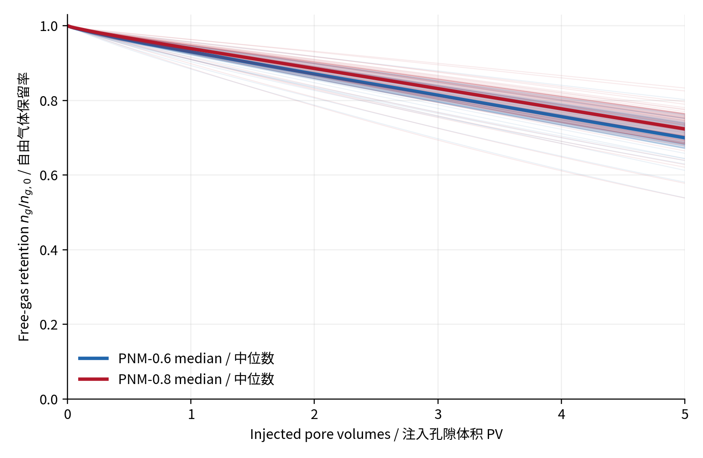
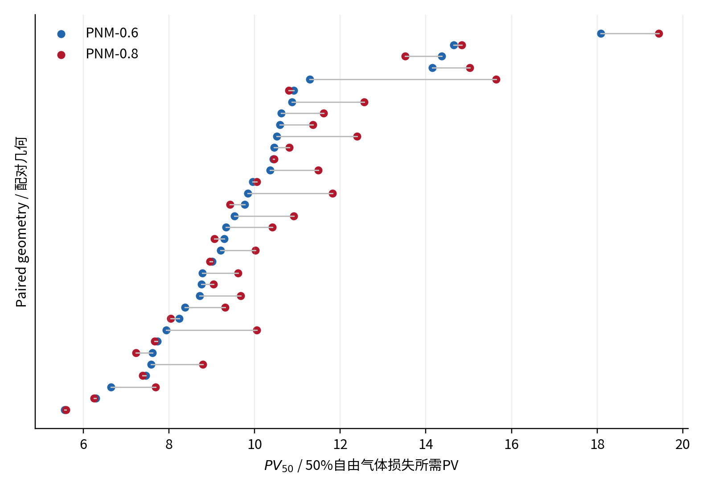
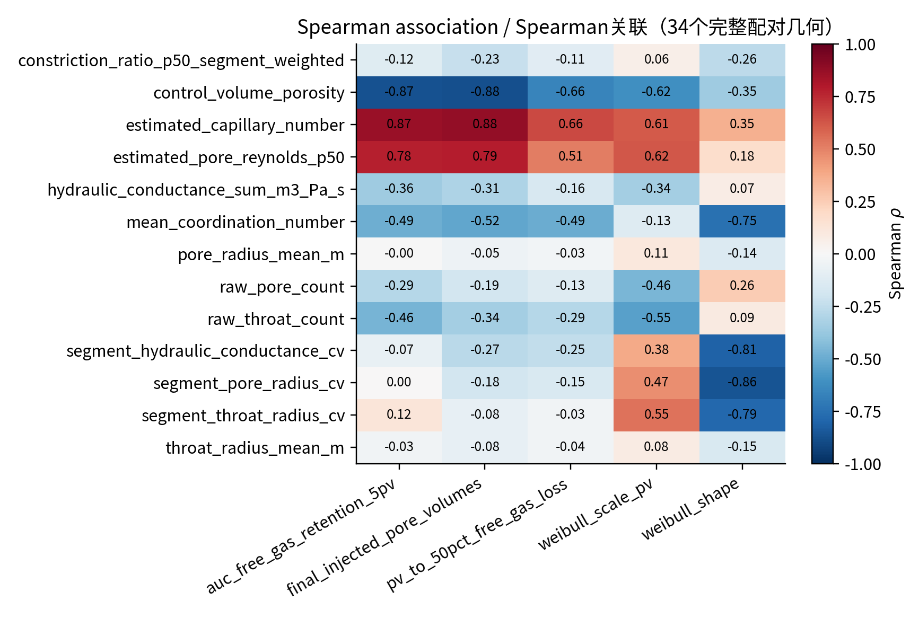
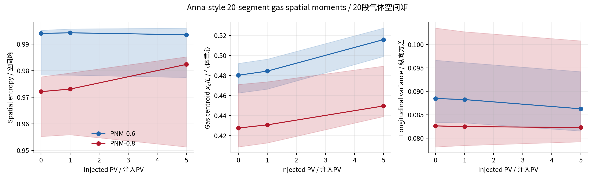

# 69个有效孔隙网络算例的气泡耐久性差异统计分析报告

**报告日期：** 2026年9月16日
**研究对象：** 35套孔隙几何、69个有效气泡溶解运行
**分析版本：** `batch69_bubble_durability_v6`
**数据状态：** 已完成算例的离线统计；修复中的第70个算例尚未纳入

---

## 摘要

本报告分析了35套由不同级配、颗粒摩擦系数和围压工况形成的孔隙网络。每套几何原则上包含两个渗吸终态：PNM-0.6和PNM-0.8，分别代表渗吸过程达到不同总体水饱和度后形成的初始困气状态。由于`85A15D / μ=0.5 / 100 kPa / PNM-0.8`的旧输入损坏，当前正式统计包含35个PNM-0.6和34个PNM-0.8，共69个有效运行；该缺失值没有通过插值或邻近样品替代。

分析结果表明，不同样品的气泡耐久性存在明显差异。损失50%初始自由气体所需的注入孔隙体积`PV50`在`5.57–19.43 PV`之间，最高值约为最低值的3.5倍。级配是目前最清晰、最稳定的差异来源；100B和60A40D总体较耐久，100C总体最容易损失自由气体。

相同孔隙几何的34组配对比较显示，PNM-0.8相较PNM-0.6的初始自由气体约少21.2%、活动含气控制体约少28.9%，但`PV50`反而提高约6.72%。这说明较充分的渗吸过程会优先清除容易接触水流的气体，留下的困气虽然总量更少，却具有更高的相对耐久性。

孔隙率和网络连通性也表现出明确关联：孔隙率越高、平均配位数越大，单位注入孔隙体积造成的自由气体损失通常越快。平均孔径、平均喉径和中位收缩比本身未表现出稳定的单变量关系，说明气泡耐久性不能由单一平均尺寸解释，更可能受网络连通路径、局部冲刷暴露和初始困气位置共同控制。

本报告中的结果是数值模型内部的稳健关联，不能单独证明实验因果关系。Henry系数、液膜传质系数、界面面积闭合、毛细压力模型和静止气泡假设仍需实验标定。

---

## 1. 研究目的

本研究关注如下作用链：

```text
级配、颗粒摩擦系数、围压
              ↓
       多孔介质孔隙结构
              ↓
   渗吸后的初始困气形态
              ↓
局部水流冲刷、扩散和界面传质
              ↓
 气体损失速度、位置和耐久程度
```

需要回答的核心问题包括：

1. 69个有效运行之间是否存在可量化的耐久性差异？
2. 哪些级配或制样工况对应更耐久的困气状态？
3. PNM-0.6和PNM-0.8在同一孔隙几何下有何差别？
4. 孔隙率、连通性、孔喉尺寸和困气空间分布中，哪些指标与耐久性关联最强？
5. 气体在冲刷过程中是否呈现入口优先损失和下游残留现象？

---

## 2. 数据范围与比较设计

### 2.1 数据组成

当前统计数据包括：

| 项目 | 数量 |
|---|---:|
| 不同孔隙几何 | 35 |
| PNM-0.6有效运行 | 35 |
| PNM-0.8有效运行 | 34 |
| 有效运行总数 | 69 |
| 完整PNM-0.6/0.8配对 | 34 |
| 级配类型 | 7 |

7种级配为：

```text
100B、100C、100D、25ABCD、33ABC、60A40D、85A15D
```

每种级配包含5种制样工况：

- 在100 kPa下比较`μ=0.1、0.3、0.5`；
- 在`μ=0.5`下比较围压`20、100、200 kPa`；
- `μ=0.5、100 kPa`同时属于上述两个比较组。

该设计不是完整的“摩擦系数×围压”全因子设计，因此不能推断未实际计算的参数组合。

### 2.2 排除项

旧的`85A15D / μ=0.5 / 100 kPa / PNM-0.8`因上游喉饱和度历史截断而被排除。它没有被零值填补，也没有使用PNM-0.6或相邻样品替代。

目前新提供的完整输入已经通过审计并重新运行，但在其达到正式终止条件之前，不加入本报告的69例统计。

### 2.3 为什么统计独立样本是35套几何

PNM-0.6与PNM-0.8使用相同孔隙几何，仅初始渗吸饱和度和困气分布不同。因此69个运行不是69套相互独立的多孔介质。对于几何结构关联，本报告以35套几何为基本样本；对于0.6/0.8比较，则采用同一几何内的配对差值，避免把重复几何当成独立样本。

---

## 3. 关键统计指标及通俗解释

### 3.1 注入孔隙体积PV

注入孔隙体积定义为：

\[
PV=\frac{\text{累计注入液体体积}}{\text{样品孔隙体积}}.
\]

`PV=1`表示累计注入水量等于样品自身孔隙体积。使用PV而不是只使用秒，可以部分消除样品孔隙体积不同造成的比较偏差。

### 3.2 自由气体保留率

\[
R_n(PV)=\frac{n_g(PV)}{n_{g,0}},
\]

其中`n_g(PV)`是当前自由气体摩尔数，`n_g,0`是初始自由气体摩尔数。

- `R_n=1`：尚未损失自由气体；
- `R_n=0.5`：已损失一半自由气体；
- `R_n`越高：相同注水量下气体保留得越多。

### 3.3 PV50

`PV50`是自由气体损失50%时的PV：

> PV50越大，需要注入越多脱气水才能损失一半气体，因此气泡越耐久。

它是本报告最主要、最直观的耐久性指标。

### 3.4 曲线AUC

AUC是“曲线下面积”。本报告计算0–5 PV范围内自由气体保留曲线的归一化面积：

\[
AUC_{0-5}=\frac{1}{5}\int_0^5R_n(PV)\,dPV.
\]

它可以通俗地理解为：

> 前5个PV冲刷过程中，样品平均保留了多少比例的自由气体。

例如`AUC=0.86`，表示在0–5 PV阶段平均约保留86%的初始自由气体。AUC越大，早期气体损失越慢。

### 3.5 Spearman相关系数

Spearman相关系数`ρ`在`−1`到`+1`之间：

- 接近`+1`：一个指标增加时，另一个通常也增加；
- 接近`−1`：一个指标增加时，另一个通常减少；
- 接近`0`：没有明显稳定的单调关系。

相关只表示共同变化，不能自动证明因果关系。

### 3.6 p值和FDR校正

`p值`用于衡量：如果实际上没有组间差异，当前这样明显的差异由随机波动产生的可能性是否很小。通常把`p<0.05`作为值得关注的阈值。

本研究同时检验了多个级配、工况、结构和耐久性指标。检验越多，偶然出现一个`p<0.05`的机会越大。FDR校正用于控制多次检验中的“假阳性”比例。

因此，本报告优先使用FDR校正后的p值。它不会修改原始数据，只是使统计判断更保守。

### 3.7 Weibull尺度和形状参数

自由气体保留曲线还采用：

\[
R_n(PV)=\exp\left[-\left(\frac{PV}{\lambda}\right)^\beta\right]
\]

进行压缩描述：

- `λ`是耐久尺度，越大表示整体衰减越慢；
- `β`描述曲线形状；
- `β>1`表示单位PV的相对损失速率总体随冲刷过程增加。

该拟合用于辅助归纳曲线，不代替原始保留曲线和PV50。

---

## 4. 数值结果可信度

69个运行均以主贯通域气体饱和度达到目标阈值正常结束。统计范围内：

| 审计指标 | 最大值 |
|---|---:|
| 调整后摩尔守恒误差`|epsilon_N|` | `2.95×10⁻¹³` |
| 调整后体积守恒误差`|epsilon_V|` | `6.51×10⁻¹⁴` |

所有接受步均经过Newton残量和相对增量双重门槛、状态边界、非负自由气体及守恒检查。上述误差远低于配置的硬阈值，因此本报告观察到的组间差异不是由明显的守恒漂移造成的。

---

## 5. 总体耐久性差异

69个有效运行的主要耐久性指标范围为：

| 指标 | 最小值 | 中位数 | 最大值 |
|---|---:|---:|---:|
| PV50 | 5.57 | 9.77 | 19.43 |
| 0–5 PV AUC | 0.748 | 0.847 | 0.915 |
| 达到终止条件的PV | 5.74 | 23.35 | 59.31 |
| 达到终止条件的物理时间/s | 156.3 | 398.4 | 835.7 |
| Weibull尺度λ/PV | 7.94 | 12.64 | 20.88 |

最高PV50约为最低值的3.5倍，说明不同样品的耐久性差异具有实际量级，而不是只存在很小的统计波动。



图中细线为各算例，粗线为两种初态的中位曲线，阴影为中间50%的算例范围。PNM-0.8的中位曲线总体位于PNM-0.6上方，但不同样品间仍存在较宽离散范围。

---

## 6. 不同级配的差异

### 6.1 PV50结果

| 级配 | PNM-0.6 PV50中位数 | PNM-0.8 PV50中位数 | 综合判断 |
|---|---:|---:|---|
| 100B | 14.38 | 13.52 | 半衰耐久性最高，但工况间离散较大 |
| 60A40D | 10.88 | 12.56 | 早期保留和整体耐久性均较高 |
| 25ABCD | 10.37 | 10.80 | 中上水平 |
| 33ABC | 9.53 | 10.91 | PNM-0.8提高明显 |
| 85A15D | 8.73 | 9.46 | 中等偏低；PNM-0.8暂缺一组 |
| 100D | 9.21 | 9.06 | 中等偏低，两种初态接近 |
| 100C | 7.46 | 7.23 | 最容易损失自由气体 |

控制相同工况进行分块比较后，级配差异仍然存在：

| 指标 | PNM-0.6 FDR校正p值 | PNM-0.8 FDR校正p值 |
|---|---:|---:|
| PV50 | 0.010 | 0.045 |
| 0–5 PV AUC | 0.0010 | 0.0039 |

因此，级配是当前数据中最明确的工况差异来源。

100B的PV50最高，但60A40D的早期AUC最高。这说明“早期损失慢”和“达到50%损失慢”并非完全相同的问题。100B可能具有更明显的阶段性或工况离散性，而60A40D在前5 PV表现出更一致的气体保留能力。

---

## 7. PNM-0.6与PNM-0.8的配对差异

34套几何具有完整配对，结果如下：

| 指标 | PNM-0.6中位数 | PNM-0.8中位数 | PNM-0.8相对变化 |
|---|---:|---:|---:|
| 初始主域Sg | 0.210 | 0.170 | −21.1% |
| 初始自由气体/mol | `1.64×10⁻⁶` | `1.35×10⁻⁶` | −21.2% |
| 初始活动含气单元 | 6099 | 4140 | −28.9% |
| PV50/PV | 9.43 | 10.05 | +6.72% |
| 0–5 PV AUC | 0.842 | 0.859 | +1.53% |
| Weibull尺度λ/PV | 12.41 | 13.02 | +6.33% |
| Weibull形状β | 1.295 | 1.299 | +0.61% |

PV50配对差值的95% bootstrap区间为`+0.030～+0.991 PV`，Wilcoxon检验未校正`p=2.48×10⁻⁴`。AUC差异的未校正`p=1.32×10⁻⁶`。



其物理含义不是“PNM-0.8含有更多气体”，而是：

> PNM-0.8初始气体更少，但剩余气体需要更多单位孔隙体积的脱气水才能损失一半。

较充分的渗吸可能先排除或溶解位于高流速、易接触区域的气体，使最终保留下来的气体更集中于旁支、低流速或受遮蔽位置。

达到`Sg=0.01`终止条件所需的最终PV在两组之间没有显著配对差异（`p=0.879`）。原因是终止条件基于气体体积饱和度，而PV50基于自由气体摩尔数；气体压力变化会使两种指标不完全同步。因此最终终止时间不能代替自由气体耐久性指标。

---

## 8. 孔隙结构与耐久性的关联

采用34套完整配对几何的平均耐久性进行分析，避免将PNM-0.6和PNM-0.8当作两套独立几何。

### 8.1 孔隙率

孔隙率与耐久性呈明显负相关：

| 关系 | Spearman ρ | 95% bootstrap区间 |
|---|---:|---:|
| 孔隙率—PV50 | −0.661 | −0.833～−0.392 |
| 孔隙率—0–5 PV AUC | −0.868 | −0.929～−0.743 |

在当前固定入口流量和PV归一化下，孔隙率较大的样品通常表现出更快的自由气体损失。

### 8.2 网络连通性

平均配位数与PV50的`ρ=−0.494`，FDR校正`p=0.0098`；与AUC的`ρ=−0.489`，FDR校正`p=0.0103`。

这表明网络连接越充分，脱气水越容易接触不同含气区域，从而降低气体的水力遮蔽程度。

### 8.3 平均孔喉尺寸

当前平均孔径、平均喉径、中位收缩比与PV50或AUC的相关系数接近零或未达到统计显著。这不表示孔喉尺寸没有物理作用，而是说明：

> 单一平均尺寸不足以描述流路瓶颈、死端、旁支和气泡局部位置。

应进一步使用孔喉分布尾部、最小割集、局部流量暴露度和气泡所在位置附近的收缩结构。

### 8.4 参数共线性警告

当前估计毛细数与孔隙率在35套几何中几乎完全秩共线。因此不能把“孔隙率效应”和“估计毛细数效应”解释为两个相互独立的机制。后续多变量分析需要剔除冗余变量或重新定义局部毛细数。



---

## 9. 初始困气空间形态

### 9.1 纵向分散程度

初始气体沿流动方向的分散程度与PV50呈负相关：

| 初态 | Spearman ρ |
|---|---:|
| PNM-0.6 | −0.477 |
| PNM-0.8 | −0.750 |

气体沿流向分布越广，通常有越多含气区域处于有效冲刷路径中，因此气体损失更快。PNM-0.8中的关系更强，说明在气体总量较少时，空间位置可能比数量本身更重要。

### 9.2 气体分布集中度

PNM-0.8的气体Gini系数中位数低于PNM-0.6约4.4%，表示PNM-0.8中自由气体摩尔数在活动含气单元之间稍更均匀。归一化气体熵总体接近，但熵与Weibull曲线形状具有较强关联。该关系主要用于描述曲线形状，不应单独解释为因果机制。

### 9.3 气体重心

前5 PV内的气体重心变化为：

| 初态 | 初始重心 | 5 PV重心 | 变化方向 |
|---|---:|---:|---|
| PNM-0.6 | 0.480 | 0.516 | 向下游移动 |
| PNM-0.8 | 0.428 | 0.450 | 向下游移动 |

其中0表示入口、1表示出口。结果说明入口附近气体优先损失，剩余气体逐渐偏向下游。

### 9.4 20段空间熵

沿流向20段的气体空间熵中位数：

- PNM-0.6：`0.9940 → 0.9935`，基本稳定；
- PNM-0.8：`0.9721 → 0.9823`，随冲刷趋于更均匀。



这组结果采用Anna博士论文中的子体积分析和空间矩思路，但将组分质量替换为自由气体摩尔库存。

---

## 10. 摩擦系数与围压

### 10.1 摩擦系数

在100 kPa下比较`μ=0.1、0.3、0.5`，PV50、AUC和最终PV均未显示通过FDR校正的显著差异。

因此目前不能表述为“颗粒摩擦系数直接决定气泡耐久性”。更合理的假设是：摩擦系数先影响颗粒重排和孔隙结构，再由孔隙结构间接影响气体耐久性。

### 10.2 围压

在`μ=0.5`下，20 kPa组的PV50通常低于100和200 kPa组，即低围压下气体更容易损失。但多重比较校正后的最小p值约为0.095，未达到0.05。

所以现阶段应写为：

> 围压可能影响气泡耐久性，当前结果表现出趋势，但独立统计证据仍不足。

---

## 11. 气泡消失事件的解释限制与局限性

逐含气控制体生存表包含377,201个初始活动含气单元。其中：

| 状态 | 数量 |
|---|---:|
| 守恒型微小气泡批量退休事件 | 221,239 |
| 精确定位消失事件 | 570 |
| 终止时仍存活、按右删失处理 | 155,392 |

大量微小含气单元通过守恒型批量退休处理，其事件时间是接受时间步内估算的阈值穿越时间，不是逐个重新求解的精确事件时刻。因此：

- 事件次数不是首要耐久性指标；
- 主结果应采用自由气体摩尔保留率、PV50和AUC；
- 气泡数量生存曲线应作为敏感性分析；
- 当前`active_bubble_count`严格表示活动含气控制体数，不等于经过气相连通聚类识别的真实独立气泡数。

---

## 12. 主要结论及证据强度

### 证据较强

1. **不同样品气泡耐久性存在明显差异。** PV50最大值约为最小值的3.5倍。
2. **级配是当前最明确的工况影响因素。** 级配对PV50和早期AUC的差异在多重比较校正后仍显著。
3. **PNM-0.8气体更少但相对更耐久。** 相同几何配对中，PNM-0.8的PV50提高约6.72%。
4. **孔隙率和网络连通性与耐久性显著关联。** 高孔隙率、高配位数通常对应更快的单位PV气体损失。
5. **初始困气位置很重要。** 气体纵向分布越广，通常越容易损失；剩余气体重心随冲刷向下游移动。

### 有趋势但证据不足

1. 低围压20 kPa组可能比100和200 kPa更容易损失气体；
2. PNM-0.8的空间选择性可能比PNM-0.6更强；
3. 早期保留能力和50%损失寿命可能受不同结构机制控制。

### 当前不支持

1. 平均孔径越大就一定越耐久；
2. 平均喉径越小就一定越耐久；
3. 活动含气单元数量越多就一定越耐久；
4. 摩擦系数在当前设计中具有稳定的直接效应。

---

## 13. 推荐的后续分析

### 13.1 完成第70例后重新统计

修复的`85A15D / μ=0.5 / 100 kPa / PNM-0.8`应在达到相同终止条件后加入配对分析。需要重点检查：

- 级配效应的FDR校正结果是否保持；
- 85A15D的PNM-0.6/0.8配对效应；
- 孔隙率、配位数和空间分散度相关系数的敏感性。

### 13.2 局部流动暴露分析

对每个初始含气控制体计算：

\[
E_i=\frac{\sum_j|Q_{ij}|}{V_i},
\]

并关联其消失PV、等效半径、局部收缩比和距入口距离。这将直接检验“受冲刷程度决定耐久性”的机理。

### 13.3 气相连通聚类

按照含气孔喉的空间连通性，将多个活动含气控制体聚类为真实气相团簇，再统计：

- 团簇数量；
- 团簇体积和摩尔数分布；
- 团簇表面积/体积比；
- 团簇距主流通道距离；
- 团簇寿命。

这能解决“活动含气控制体不等于真实气泡”的定义问题。

### 13.4 多变量和中介分析

可建立两组模型：

```text
工况 → 孔隙结构
孔隙结构 + 初始困气形态 → PV50/AUC
```

样本只有35套独立几何，建议采用少变量模型、PCA或正则化回归，并使用按几何分组的交叉验证；不建议使用复杂深度学习模型。

### 13.5 实验标定

在用于绝对时间预测前，应标定：

- Henry系数和有效空气组分；
- 液膜传质系数`kL`；
- 气液界面面积闭合；
- 毛细压力参数和接触角；
- 扩散曲折度及相对导流模型；
- 当前入口流量和Pe/Ca范围的实验代表性。

---

## 14. 数据与可重复性

主要机器可读结果位于：

```text
/workspace/zz/bubble_dissolution_solver_amgx/output/analysis/
batch69_bubble_durability_v6/
```

核心文件：

| 文件 | 内容 |
|---|---|
| `case_metrics.tsv` | 69个算例的汇总指标 |
| `retention_curves_common_0_5pv.tsv` | 公共PV网格上的自由气体保留曲线 |
| `paired_p06_p08.tsv` | 34组PNM-0.6/0.8配对结果 |
| `paired_effects.tsv` | 配对效应和统计检验 |
| `geometry_durability_correlations.tsv` | 孔隙结构—耐久性关联 |
| `initial_gas_morphology_correlations.tsv` | 初始困气形态—耐久性关联 |
| `gas_spatial_moments_20segments.tsv` | 20段气体空间矩和空间熵 |
| `segment_event_metrics.tsv` | 分段气泡消失统计 |
| `gas_unit_survival.tsv.gz` | 逐含气控制体生存/删失记录 |
| `analysis_manifest.json` | 输入、排除项、方法和所有结果SHA-256 |

分析程序：

```text
/workspace/zz/bubble_dissolution_solver_amgx/scripts/
analyze_batch69_durability.py
```

该分析只读取生产结果，没有改写求解器、原始PNM或历史运行目录。

---

## 15. 最终总结

69个有效算例已经能够显示清晰的样品差异。最重要的规律不是“平均孔越大或越小”，而是：

> 不同级配和制样条件形成不同的孔隙率、网络连通性与流路结构；渗吸过程又在这些结构中形成不同的困气数量和空间分布；最终，脱气水对气体的局部可达性和冲刷暴露程度决定了气体保留曲线与耐久寿命。

在当前数据中，级配、孔隙率、平均配位数、PNM-0.6/0.8状态以及初始气体空间分散程度是最值得进入论文主结果的指标。摩擦系数和围压可作为次级或趋势性结果；平均孔径和单纯气泡数量不宜作为主要解释变量。
