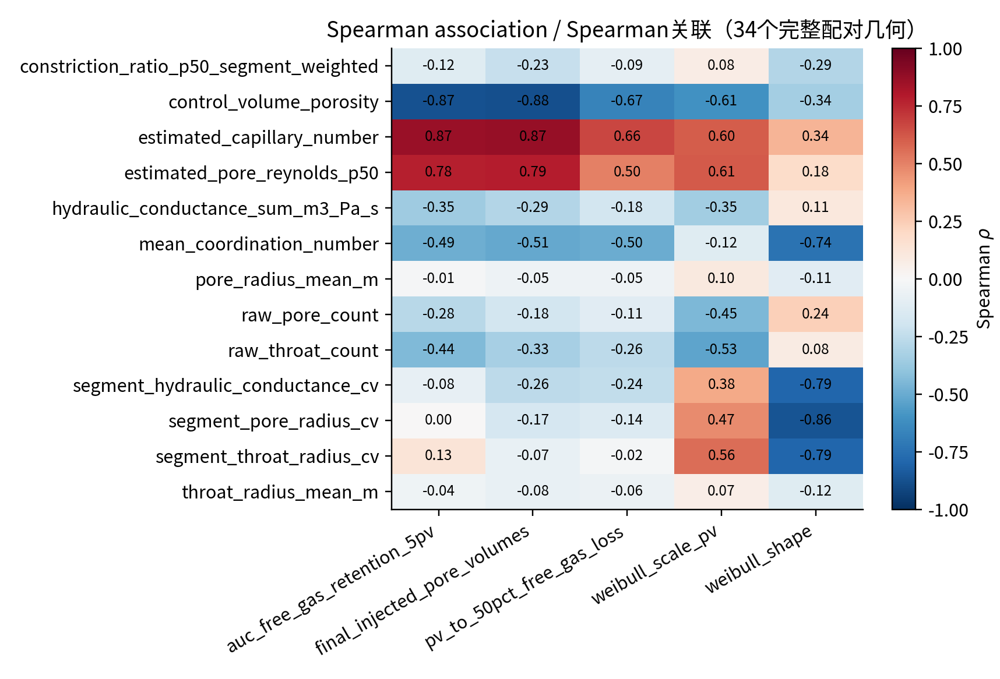
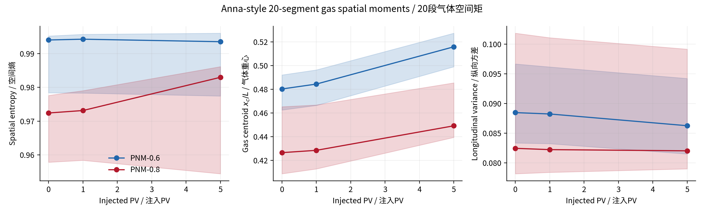

# 70个有效孔隙网络算例的气泡耐久性差异统计分析报告

**报告日期：** 2026年9月17日
**研究对象：** 35套孔隙几何、70个有效气泡溶解运行
**分析版本：** `batch70_bubble_durability_v1`
**数据状态：** 已完成算例的离线统计；第70个算例（修复后重跑）已纳入
**上一版报告：** `docs/69样品气泡耐久性差异统计分析报告_20260916.md`（保留为历史版本，未修改）

---

## 摘要

本报告分析了35套由不同级配、颗粒摩擦系数和围压工况形成的孔隙网络。每套几何包含两个渗吸终态：PNM-0.6和PNM-0.8，分别代表渗吸过程达到不同总体水饱和度后形成的初始困气状态。上一版报告中缺失的`85A15D / μ=0.5 / 100 kPa / PNM-0.8`已用新提供的完整喉饱和度历史修复并重新运行，达到与其余算例相同的终止条件。因此本版第一次包含完整的70个有效运行和35组完整配对，无排除项、无插值替代。

分析结果表明，不同样品的气泡耐久性存在明显差异。损失50%初始自由气体所需的注入孔隙体积`PV50`在`5.57–19.43 PV`之间，最高值约为最低值的3.5倍。级配是目前最清晰、最稳定的差异来源；100B和60A40D总体较耐久，100C总体最容易损失自由气体。

相同孔隙几何的35组配对比较显示，PNM-0.8相较PNM-0.6的初始自由气体约少20.2%、活动含气控制体约少28.3%，但`PV50`反而提高约7.24%。这说明较充分的渗吸过程会优先清除容易接触水流的气体，留下的困气虽然总量更少，却具有更高的相对耐久性。

孔隙率和网络连通性也表现出明确关联：孔隙率越高、平均配位数越大，单位注入孔隙体积造成的自由气体损失通常越快。平均孔径、平均喉径和中位收缩比本身未表现出稳定的单变量关系，说明气泡耐久性不能由单一平均尺寸解释，更可能受网络连通路径、局部冲刷暴露和初始困气位置共同控制。

与上一版69例报告相比，全部既有结论保持不变并得到两处增强：级配效应更强（5个完整分块下PNM-0.8的PV50 FDR由0.045降至0.0087），围压效应在PNM-0.8中首次通过FDR校正（PV50 FDR=0.047）。

本报告中的结果是数值模型内部的稳健关联，不能单独证明实验因果关系。Henry系数、液膜传质系数、界面面积闭合、毛细压力模型和静止气泡假设仍需实验标定。

---

## 1. 研究目的

本研究关注如下作用链：

```text
级配、颗粒摩擦系数、围压
              ↓
       多孔介质孔隙结构
              ↓
   渗吸后的初始困气形态
              ↓
局部水流冲刷、扩散和界面传质
              ↓
 气体损失速度、位置和耐久程度
```

需要回答的核心问题包括：

1. 70个有效运行之间是否存在可量化的耐久性差异？
2. 哪些级配或制样工况对应更耐久的困气状态？
3. PNM-0.6和PNM-0.8在同一孔隙几何下有何差别？
4. 孔隙率、连通性、孔喉尺寸和困气空间分布中，哪些指标与耐久性关联最强？
5. 气体在冲刷过程中是否呈现入口优先损失和下游残留现象？
6. 纳入修复的第70例后，69例报告的结论是否保持不变？

---

## 2. 数据范围与比较设计

### 2.1 数据组成

当前统计数据包括：

| 项目 | 数量 |
|---|---:|
| 不同孔隙几何 | 35 |
| PNM-0.6有效运行 | 35 |
| PNM-0.8有效运行 | 35 |
| 有效运行总数 | 70 |
| 完整PNM-0.6/0.8配对 | 35 |
| 级配类型 | 7 |
| 排除项 | 0 |

7种级配为：

```text
100B、100C、100D、25ABCD、33ABC、60A40D、85A15D
```

每种级配包含5种制样工况：

- 在100 kPa下比较`μ=0.1、0.3、0.5`；
- 在`μ=0.5`下比较围压`20、100、200 kPa`；
- `μ=0.5、100 kPa`同时属于上述两个比较组。

该设计不是完整的“摩擦系数×围压”全因子设计，因此不能推断未实际计算的参数组合。70个运行全部以`main_real_gas_saturation_reached`正常结束，没有任何算例因数值失败、超时或守恒问题被剔除。

### 2.2 与上一版（69例）的区别

上一版报告因`85A15D / μ=0.5 / 100 kPa / PNM-0.8`的旧上游喉饱和度历史截断而将该算例排除，其余69个运行构成统计基础。本次修复重新提供了完整的`default_throat_sw.out`（50,928行×151列，sha256 `1e51e976e07c66b5f92d6220eab26419a19153b0d03077226565b45f6a4ac1d8`），并按严格的行数、端点及inside校验重建饱和度叠加层，仅替换`Sw`列，保留原批次几何。修复后该算例已在相同物理模型和相同终止条件下正常完成（详见第4节），并作为第70个有效样本纳入本报告。

70个输入已全部通过饱和度来源审计（`saturation_source_audit_v70.json`，70/70 passed），旧失败现场保留为证据、未被修改或删除。

### 2.3 为什么统计独立样本是35套几何

PNM-0.6与PNM-0.8使用相同孔隙几何，仅初始渗吸饱和度和困气分布不同。因此70个运行不是70套相互独立的多孔介质。对于几何结构关联，本报告以35套几何为基本样本；对于0.6/0.8比较，则采用同一几何内的配对差值，避免把重复几何当成独立样本。

---

## 3. 关键统计指标及通俗解释

### 3.1 注入孔隙体积PV

注入孔隙体积定义为：

\[
PV=\frac{\text{累计注入液体体积}}{\text{样品孔隙体积}}.
\]

`PV=1`表示累计注入水量等于样品自身孔隙体积。使用PV而不是只使用秒，可以部分消除样品孔隙体积不同造成的比较偏差。

### 3.2 自由气体保留率

\[
R_n(PV)=\frac{n_g(PV)}{n_{g,0}},
\]

其中`n_g(PV)`是当前自由气体摩尔数，`n_g,0`是初始自由气体摩尔数。

- `R_n=1`：尚未损失自由气体；
- `R_n=0.5`：已损失一半自由气体；
- `R_n`越高：相同注水量下气体保留得越多。

### 3.3 PV50

`PV50`是自由气体损失50%时的PV：

> PV50越大，需要注入越多脱气水才能损失一半气体，因此气泡越耐久。

它是本报告最主要、最直观的耐久性指标。

### 3.4 曲线AUC

AUC是“曲线下面积”。本报告计算0–5 PV范围内自由气体保留曲线的归一化面积：

\[
AUC_{0-5}=\frac{1}{5}\int_0^5R_n(PV)\,dPV.
\]

它可以通俗地理解为：

> 前5个PV冲刷过程中，样品平均保留了多少比例的自由气体。

例如`AUC=0.86`，表示在0–5 PV阶段平均约保留86%的初始自由气体。AUC越大，早期气体损失越慢。

### 3.5 Spearman相关系数

Spearman相关系数`ρ`在`−1`到`+1`之间：

- 接近`+1`：一个指标增加时，另一个通常也增加；
- 接近`−1`：一个指标增加时，另一个通常减少；
- 接近`0`：没有明显稳定的单调关系。

相关只表示共同变化，不能自动证明因果关系。

### 3.6 p值和FDR校正

`p值`用于衡量：如果实际上没有组间差异，当前这样明显的差异由随机波动产生的可能性是否很小。通常把`p<0.05`作为值得关注的阈值。

本研究同时检验了多个级配、工况、结构和耐久性指标。检验越多，偶然出现一个`p<0.05`的机会越大。FDR校正用于控制多次检验中的“假阳性”比例。

因此，本报告优先使用FDR校正后的p值。它不会修改原始数据，只是使统计判断更保守。

### 3.7 Weibull尺度和形状参数

自由气体保留曲线还采用：

\[
R_n(PV)=\exp\left[-\left(\frac{PV}{\lambda}\right)^\beta\right]
\]

进行压缩描述：

- `λ`是耐久尺度，越大表示整体衰减越慢；
- `β`描述曲线形状；
- `β>1`表示单位PV的相对损失速率总体随冲刷过程增加。

该拟合用于辅助归纳曲线，不代替原始保留曲线和PV50。

---

## 4. 第70例输入修复与替换

本节记录`85A15D / μ=0.5 / 100 kPa / PNM-0.8`从排除到纳入的完整链条，供论文方法部分和审计追溯使用。

### 4.1 缺陷与修复方式

| 环节 | 结果 |
|---|---|
| 新原始喉饱和度 | `default_throat_sw.out`，50,928行×151列，sha256 `1e51e976…ac1d8` |
| 旧输入缺陷 | 旧`PNM_pt.txt`内部喉50,005条中49,991条`Sw=0`（99.97%） |
| 修复方式 | 严格按行/端点/inside校验重建饱和度叠加；几何列保留原批覆盖层，仅替换`Sw` |
| 修复后零Sw | 6 / 50,005（0.012%），内部喉平均`Sw=0.9609` |
| 修复后初始状态 | 体积加权主域`Sg=0.2111`（85A15D p08组范围0.182–0.221，合理） |

修复产物位于`output/batch35_inputs_repaired/sands-of-85A15D-mu-0.5-100kpa-e/p08_saturation_overlay_v1/`，包含`PNM_pb.txt`、`PNM_pt.txt`、`converted_geometry/`、`saturation_overlay_audit.json`（sha256 `ffb206bb…e903651`）和`repair_launch_audit.json`。原始PNM文件与其哈希在派生前后保持不变。

### 4.2 验证与生产运行

| 环节 | 结果 |
|---|---|
| pilot（预备性短跑） | `output/verification/repaired_85A15D_p08/pilot_t0p02_v4/`，20/20步通过，exit 0 |
| 生产配置 | `configs/repaired_85A15D_p08_v1/sands-of-85A15D-mu-0.5-100kpa-e_p08_repaired_production.json`，sha256 `80c801d5…9275e` |
| 求解器 | `build-bubble-batch-retirement-release/bubble_solver`，sha256 `6ea4e9c1…5ebd04`，PARDISO后端，8线程 |
| 生产运行 | exit 0；2,502个接受步；`t=572.385544 s`；2,912个消失事件；终态主域`Sg=0.0099954`（目标0.01） |
| 数值质量 | max`residual_scaled_inf`=3.35e-9（<1e-8）；max`|εN|`=2.78e-14；max`|εV|`=2.97e-14；重试114次；Newton双判据全部通过 |
| 关键指标 | 初始Sg 0.2112；PV50=10.24；AUC=0.8697；终止PV=27.23；Weibull λ=13.13 |

该算例未使用任何checkpoint续算（从`t=0`起算），旧失败现场
`output/production/batch35_flow_pe555_pardiso/sands-of-85A15D-mu-0.5-100kpa-e_p08_boundaryless_frozen_recovery/`
及其`DO_NOT_USE_FOR_SCIENCE.md`、`INVALID_INPUT_AUDIT.json`标记保持不变。

### 4.3 独立性与一致性检查

- 修复后的初始Sg（0.2112）落在同组5个PNM-0.8算例（0.182–0.221）的范围之内，没有出现异常初态；
- 几何孪生对照：同工况PNM-0.6（`μ=0.5、100 kPa`）的PV50=8.76，修复后PNM-0.8=10.24，提高16.9%，与其余配对“PNM-0.8更耐久”的方向一致；
- 该算例的数值质量指标（残量、守恒、重试）落在其余69例的同一量级。

---

## 5. 数值结果可信度

70个运行均以主贯通域气体饱和度达到目标阈值正常结束（`main_real_gas_saturation_reached`）。统计范围内：

| 审计指标 | 最大值 |
|---|---:|
| 调整后摩尔守恒误差`\|epsilon_N\|` | `2.95×10⁻¹³` |
| 调整后体积守恒误差`\|epsilon_V\|` | `6.51×10⁻¹⁴` |
| 缩放后Newton残量`max residual_scaled_inf` | `1.00×10⁻⁸`（低于硬阈值） |

所有接受步均经过Newton残量和相对增量双重门槛、状态边界、非负自由气体及守恒检查。上述误差远低于配置的硬阈值，因此本报告观察到的组间差异不是由明显的守恒漂移造成的。

---

## 6. 总体耐久性差异

70个有效运行的主要耐久性指标范围为：

| 指标 | 最小值 | 中位数 | 最大值 |
|---|---:|---:|---:|
| PV50 | 5.57 | 9.80 | 19.43 |
| 0–5 PV AUC | 0.748 | 0.8475 | 0.915 |
| 达到终止条件的PV | 5.74 | 23.39 | 59.31 |
| 达到终止条件的物理时间/s | 156.3 | 400.0 | 835.7 |
| Weibull尺度λ/PV | 7.94 | 12.65 | 20.88 |
| Weibull形状β | 0.960 | 1.296 | 1.371 |

最高PV50约为最低值的3.5倍，说明不同样品的耐久性差异具有实际量级，而不是只存在很小的统计波动。

按初态分列的保留水平（中位数）：

| 指标 | PNM-0.6 | PNM-0.8 |
|---|---:|---:|
| 1 PV保留率 | 0.9303 | 0.9399 |
| 5 PV保留率 | 0.7001 | 0.7258 |
| 终止时保留率 | 0.0589 | 0.0661 |


图中细线为各算例，粗线为两种初态的中位曲线，阴影为中间50%的算例范围。PNM-0.8的中位曲线总体位于PNM-0.6上方，但不同样品间仍存在较宽离散范围。

---

## 7. 不同级配的差异

### 7.1 PV50结果

| 级配 | PNM-0.6 PV50中位数 | PNM-0.8 PV50中位数 | 综合判断 |
|---|---:|---:|---|
| 100B | 14.38 | 13.52 | 半衰耐久性最高，但工况间离散较大 |
| 60A40D | 10.88 | 12.56 | 早期保留和整体耐久性均较高 |
| 25ABCD | 10.37 | 10.80 | 中上水平 |
| 33ABC | 9.53 | 10.91 | PNM-0.8提高明显 |
| 85A15D | 8.73 | 9.61 | 中等偏低，本版已补齐5组配对 |
| 100D | 9.21 | 9.06 | 中等偏低，两种初态接近 |
| 100C | 7.46 | 7.23 | 最容易损失自由气体 |

0–5 PV AUC的前两名与PV50不完全一致：60A40D在两种初态中均最高（PNM-0.6为0.8759，PNM-0.8为0.8967），100C在两种初态中均最低（0.7973和0.7969）。这再次说明“早期损失慢”和“达到50%损失慢”并非同一个问题。

控制相同工况进行分块比较后（每种初态5个完整分块），级配差异仍然存在并进一步增强：

| 指标 | PNM-0.6 FDR校正p值 | PNM-0.8 FDR校正p值 |
|---|---:|---:|
| PV50 | 0.0087 | 0.0087 |
| 0–5 PV AUC | 0.00052 | 0.00046 |
| 达到终止条件的PV | 0.00046 | 0.00046 |

因此，级配是当前数据中最明确、最稳定的工况差异来源。

---

## 8. PNM-0.6与PNM-0.8的配对差异

35套几何全部具有完整配对，结果如下：

| 指标 | PNM-0.6中位数 | PNM-0.8中位数 | PNM-0.8相对变化 | Wilcoxon p（未校正） |
|---|---:|---:|---:|---:|
| 初始主域Sg | 0.2156 | 0.1710 | −18.24% | 1.1×10⁻⁹ |
| 初始自由气体/mol | `1.64×10⁻⁶` | `1.36×10⁻⁶` | −20.17% | 8.1×10⁻¹⁰ |
| 初始活动含气单元 | 6056 | 4187 | −28.28% | 5.8×10⁻¹¹ |
| 气体Gini系数 | 0.4321 | 0.4172 | −4.60% | 0.0010 |
| 气体重心（0入口–1出口） | 0.4801 | 0.4257 | −10.55% | 5.1×10⁻⁷ |
| 归一化气体熵 | 0.9592 | 0.9600 | +0.31% | 0.75（不显著） |
| PV50/PV | 9.331 | 10.052 | +7.24% | 1.28×10⁻⁴ |
| 0–5 PV AUC | 0.8439 | 0.8608 | +1.54% | 6.6×10⁻⁷ |
| Weibull尺度λ/PV | 12.219 | 13.032 | +7.13% | 2.2×10⁻⁵ |
| Weibull形状β | 1.2956 | 1.3028 | +0.40% | 0.051（边界） |
| 达到终止条件的PV | 22.24 | 24.27 | +1.91% | 0.74（不显著） |

PV50配对差值的95% bootstrap区间为`+0.025～+1.038 PV`；AUC差值的95% bootstrap区间为`+0.0057～+0.0196`。


其物理含义不是“PNM-0.8含有更多气体”，而是：

> PNM-0.8初始气体更少，但剩余气体需要更多单位孔隙体积的脱气水才能损失一半。

较充分的渗吸可能先排除或溶解位于高流速、易接触区域的气体，使最终保留下来的气体更集中于旁支、低流速或受遮蔽位置。

达到`Sg=0.01`终止条件所需的最终PV在两组之间没有显著配对差异。原因是终止条件基于气体体积饱和度，而PV50基于自由气体摩尔数；气体压力变化会使两种指标不完全同步。因此最终终止时间不能代替自由气体耐久性指标。

---

## 9. 孔隙结构与耐久性的关联

采用35套完整配对几何的平均耐久性进行分析，避免将PNM-0.6和PNM-0.8当作两套独立几何。

### 9.1 孔隙率

孔隙率与耐久性呈明显负相关：

| 关系 | Spearman ρ | 95% bootstrap区间 | FDR校正p |
|---|---:|---|---:|
| 孔隙率—PV50 | −0.667 | −0.834～−0.393 | 7.1×10⁻⁵ |
| 孔隙率—0–5 PV AUC | −0.868 | −0.923～−0.751 | 3.2×10⁻¹⁰ |
| 孔隙率—终止PV | −0.876 | −0.931～−0.760 | 2.3×10⁻¹⁰ |
| 孔隙率—Weibull λ | −0.608 | −0.823～−0.311 | 4.9×10⁻⁴ |

在当前固定入口流量和PV归一化下，孔隙率较大的样品通常表现出更快的自由气体损失。

### 9.2 网络连通性

| 关系 | Spearman ρ | FDR校正p |
|---|---:|---:|
| 平均配位数—PV50 | −0.496 | 0.0079 |
| 平均配位数—AUC | −0.485 | 0.0097 |
| 平均配位数—终止PV | −0.509 | 0.0064 |
| 平均配位数—Weibull形状β | −0.735 | 3.2×10⁻⁶ |
| 原始喉数—AUC | −0.442 | 0.021 |
| 原始孔数—AUC | −0.277 | 不显著 |

这表明网络连接越充分，脱气水越容易接触不同含气区域，从而降低气体的水力遮蔽程度。

### 9.3 平均孔喉尺寸

当前平均孔径、平均喉径、中位收缩比与PV50或AUC的相关系数接近零或未达到统计显著。这不表示孔喉尺寸没有物理作用，而是说明：

> 单一平均尺寸不足以描述流路瓶颈、死端、旁支和气泡局部位置。

应进一步使用孔喉分布尾部、最小割集、局部流量暴露度和气泡所在位置附近的收缩结构。

### 9.4 估计Re、估计Ca与参数共线性警告

| 关系 | Spearman ρ | FDR校正p |
|---|---:|---:|
| 估计Re—PV50 | 0.501 | 0.0075 |
| 估计Re—AUC | 0.778 | 2.8×10⁻⁷ |
| 估计Ca—PV50 | 0.664 | 7.3×10⁻⁵ |
| 估计Ca—AUC | 0.866 | 3.2×10⁻¹⁰ |

但需要特别警告：当前估计毛细数与孔隙率在35套几何中几乎完全秩共线（`ρ=−0.9997`）。因此不能把“孔隙率效应”和“估计毛细数效应”解释为两个相互独立的机制。后续多变量分析需要剔除冗余变量或重新定义局部毛细数。



---

## 10. 初始困气空间形态

### 10.1 纵向分散程度

初始气体沿流动方向的分散程度与PV50呈负相关：

| 初态 | Spearman ρ（纵向方差—PV50） | FDR校正p | ρ（纵向方差—AUC） | FDR校正p |
|---|---:|---:|---:|---:|
| PNM-0.6 | −0.477 | 0.0129 | −0.459 | 0.0179 |
| PNM-0.8 | −0.751 | 1.9×10⁻⁶ | −0.639 | 1.9×10⁻⁴ |

气体沿流向分布越广，通常有越多含气区域处于有效冲刷路径中，因此气体损失更快。PNM-0.8中的关系更强，说明在气体总量较少时，空间位置可能比数量本身更重要。

横向分散度表现出相同方向（PNM-0.6：ρ=−0.415，FDR 0.040；PNM-0.8：ρ=−0.568，FDR 0.0014），而初始活动含气单元数与PV50在两种初态中均不显著。这进一步支持“位置比数量更重要”的解释。

### 10.2 气体分布集中度与曲线形状

PNM-0.8的气体Gini系数中位数低于PNM-0.6约4.6%，表示PNM-0.8中自由气体摩尔数在活动含气单元之间稍更均匀。

归一化气体熵的组间中位数差异不显著（+0.31%，p=0.75），但熵与Weibull曲线形状的关联很强：

| 初态 | ρ（气体熵—Weibull β） | FDR校正p |
|---|---:|---:|
| PNM-0.6 | 0.834 | 1.2×10⁻⁸ |
| PNM-0.8 | 0.862 | 8.7×10⁻¹⁰ |

该关系主要用于描述曲线形状，不应单独解释为因果机制。

### 10.3 气体重心

前5 PV内的气体重心变化为：

| 初态 | 初始重心 | 5 PV重心 | 变化方向 |
|---|---:|---:|---|
| PNM-0.6 | 0.4803 | 0.5159 | 向下游移动 |
| PNM-0.8 | 0.4264 | 0.4491 | 向下游移动 |

其中0表示入口、1表示出口。结果说明入口附近气体优先损失，剩余气体逐渐偏向下游。在PNM-0.8中，初始重心越靠下游，PV50越低（ρ=−0.558，FDR 0.0015）；PNM-0.6中该关系不显著（ρ=−0.241）。

### 10.4 20段空间熵

沿流向20段的气体空间熵中位数：

- PNM-0.6：`0.9940 → 0.9935`，基本稳定；
- PNM-0.8：`0.9724 → 0.9830`，随冲刷趋于更均匀。



这组结果采用Anna博士论文中的子体积分析和空间矩思路，但将组分质量替换为自由气体摩尔库存。

---

## 11. 摩擦系数与围压

### 11.1 摩擦系数

在100 kPa下比较`μ=0.1、0.3、0.5`，PV50、AUC和最终PV均未显示通过FDR校正的显著差异（分块Friedman检验FDR≥0.41）。

因此目前不能表述为“颗粒摩擦系数直接决定气泡耐久性”。更合理的假设是：摩擦系数先影响颗粒重排和孔隙结构，再由孔隙结构间接影响气体耐久性。

### 11.2 围压

在`μ=0.5`下，20 kPa组的PV50通常低于100和200 kPa组，即低围压下气体更容易损失。本版首次出现通过FDR校正的显著结果：

| 检验 | PNM-0.6 FDR校正p | PNM-0.8 FDR校正p |
|---|---:|---:|
| PV50 | 0.166 | 0.047（显著） |
| 0–5 PV AUC | 0.090（趋势） | 0.048（显著） |
| 达到终止条件的PV | 0.509 | 0.056（边界） |

PNM-0.8的水平中位PV50：20 kPa为8.96，100 kPa为10.41，200 kPa为10.02。PNM-0.6的水平中位PV50：7.94、9.33、9.21；AUC：0.8304、0.8442、0.8458，方向一致但证据较弱。

所以现阶段应写为：

> 围压对气泡耐久性的影响在PNM-0.8中已达到统计显著（PV50 FDR=0.047），在PNM-0.6中仍为趋势；该效应需要在更多级配和工况下重复验证。

---

## 12. 气泡消失事件的解释限制与局限性

逐含气控制体生存表包含381,870个初始活动含气单元。其中：

| 状态 | 数量 |
|---|---:|
| 守恒型微小气泡批量退休事件 | 224,142 |
| 精确定位消失事件 | 579 |
| 终止时仍存活、按右删失处理 | 157,149 |

大量微小含气单元通过守恒型批量退休处理，其事件时间是接受时间步内估算的阈值穿越时间，不是逐个重新求解的精确事件时刻。因此：

- 事件次数不是首要耐久性指标；
- 主结果应采用自由气体摩尔保留率、PV50和AUC；
- 气泡数量生存曲线应作为敏感性分析；
- 当前`active_bubble_count`严格表示活动含气控制体数，不等于经过气相连通聚类识别的真实独立气泡数。

---

## 13. 相对69例报告的变化

本版把第70例纳入正式统计后，与上一版（69例、`batch69_bubble_durability_v6`）相比的更新如下：

| 指标 | 69例（v6） | 70例（本版） |
|---|---|---|
| 有效运行 / 完整配对 | 69 / 34 | 70 / 35 |
| PV50配对效应 | +6.72%，p=2.48×10⁻⁴ | +7.24%，p=1.28×10⁻⁴ |
| AUC配对效应 | +1.53%，p=1.32×10⁻⁶ | +1.54%，p=6.6×10⁻⁷ |
| Weibull λ配对变化 | +6.33% | +7.13% |
| 级配FDR（PNM-0.8 PV50） | 0.045（4个分块） | 0.0087（5个分块） |
| 围压μ=0.5（PNM-0.8 PV50 FDR） | 0.095（趋势） | 0.047（显著） |
| 孔隙率—PV50 | −0.661 | −0.667 |
| 85A15D的PNM-0.8 PV50中位数 | 9.46（4例） | 9.61（5例） |
| 85A15D PNM-0.6配对基线 | 8.73 | 8.73（未变） |

结论层面的变化：

1. **全部既有结论保持不变**：级配最强、PNM-0.8少气但更耐久、孔隙率与连通性和耐久性负相关、入口优先损失。
2. **级配效应更强**：第70例补齐了每个级配5个完整工况的平衡结构，PNM-0.8的PV50级配FDR由0.045降至0.0087。
3. **围压效应首次显著**：PNM-0.8的PV50和AUC均通过FDR校正，但水平之间差异仍不大（约8.96–10.41 PV），应表述为“统计显著但量级温和”。
4. **修复算例没有改变85A15D的定位**：修复p08（PV50=10.24）高于同工况PNM-0.6（8.76）约16.9%，与配对效应方向一致，使85A15D的PNM-0.8中位数由9.46升至9.61，仍在全部级配的中下位置。

上一版69例报告保留在`docs/69样品耐久性差异统计分析报告_20260916.md`，作为历史版本未被修改。

---

## 14. 主要结论及证据强度

### 证据较强

1. **不同样品气泡耐久性存在明显差异。** PV50最大值约为最小值的3.5倍。
2. **级配是最明确的工况影响因素。** 在5个完整分块下，级配对PV50、早期AUC和终止PV的差异仍通过FDR校正（最小FDR=0.00046）。
3. **PNM-0.8气体更少但相对更耐久。** 35组完整配对中，PNM-0.8的PV50提高约7.24%、AUC提高约1.54%。
4. **孔隙率和网络连通性与耐久性显著关联。** 高孔隙率、高配位数通常对应更快的单位PV气体损失。
5. **初始困气位置很重要。** 气体纵向和横向分布越广，通常越容易损失；剩余气体重心随冲刷向下游移动。
6. **围压效应在PNM-0.8中达到统计显著。** 20 kPa组最不耐久，100/200 kPa组接近。

### 有趋势但证据不足

1. PNM-0.6中的围压效应仍为趋势（PV50 FDR=0.166，AUC FDR=0.090）；
2. Weibull形状β的配对差异位于边界（p=0.051）；
3. PNM-0.8的空间选择性可能比PNM-0.6更强；
4. 早期保留能力和50%损失寿命可能受不同结构机制控制。

### 当前不支持

1. 平均孔径越大就一定越耐久；
2. 平均喉径越小就一定越耐久；
3. 活动含气单元数量越多就一定越耐久；
4. 摩擦系数在当前设计中具有稳定的直接效应；
5. 估计毛细数可以被解释为独立于孔隙率的第二个机制。

---

## 15. 推荐的后续分析

### 15.1 局部流动暴露分析

对每个初始含气控制体计算：

\[
E_i=\frac{\sum_j|Q_{ij}|}{V_i},
\]

并关联其消失PV、等效半径、局部收缩比和距入口距离。这将直接检验“受冲刷程度决定耐久性”的机理。

### 15.2 气相连通聚类

按照含气孔喉的空间连通性，将多个活动含气控制体聚类为真实气相团簇，再统计：

- 团簇数量；
- 团簇体积和摩尔数分布；
- 团簇表面积/体积比；
- 团簇距主流通道距离；
- 团簇寿命。

这能解决“活动含气控制体不等于真实气泡”的定义问题。

### 15.3 多变量和中介分析

可建立两组模型：

```text
工况 → 孔隙结构
孔隙结构 + 初始困气形态 → PV50/AUC
```

样本只有35套独立几何，建议采用少变量模型、PCA或正则化回归，并使用按几何分组的交叉验证；由于估计Ca与孔隙率近共线，必须做变量筛选；不建议使用复杂深度学习模型。

### 15.4 修复流程推广

第70例的“严格行/端点/inside校验＋仅替换饱和度列＋几何列保持不变”修复流程可以固化为脚本和审计模板，用于将来其他来源的饱和度历史替换，所有派生输入均记录前后SHA-256。

### 15.5 实验标定

在用于绝对时间预测前，应标定：

- Henry系数和有效空气组分；
- 液膜传质系数`kL`；
- 气液界面面积闭合；
- 毛细压力参数和接触角；
- 扩散曲折度及相对导流模型；
- 当前入口流量和Pe/Ca范围的实验代表性。

---

## 16. 数据与可重复性

主要机器可读结果位于：

```text
/workspace/zz/bubble_dissolution_solver_amgx/output/analysis/
batch70_bubble_durability_v1/
```

核心文件：

| 文件 | 内容 |
|---|---|
| `case_metrics.tsv` | 70个算例的汇总指标 |
| `retention_curves_common_0_5pv.tsv` | 公共PV网格上的自由气体保留曲线 |
| `paired_p06_p08.tsv` | 35组PNM-0.6/0.8配对结果 |
| `paired_effects.tsv` | 配对效应和统计检验 |
| `complete_pair_geometry_metrics.tsv` | 35套几何层指标（避免伪重复） |
| `geometry_durability_correlations.tsv` | 孔隙结构—耐久性关联 |
| `initial_gas_morphology_correlations.tsv` | 初始困气形态—耐久性关联 |
| `gas_spatial_moments_20segments.tsv` | 20段气体空间矩和空间熵 |
| `segment_event_metrics.tsv` | 分段气泡消失统计 |
| `gas_unit_survival.tsv.gz` | 逐含气控制体生存/删失记录 |
| `factor_level_summaries.tsv`、`blocked_factor_tests.tsv` | 分块工况分析 |
| `analysis_manifest.json` | 输入、排除项、方法和所有结果SHA-256 |

关键输入与程序：

| 对象 | 标识 |
|---|---|
| 输入清单 | `output/analysis/batch70_inputs/batch_cases_v70.json`，sha256 `1f1e6280…72115` |
| 输入审计 | `output/analysis/batch70_inputs/saturation_source_audit_v70.json`，sha256 `ce5c586b…c42ce`，70/70 passed |
| 分析程序 | `scripts/analyze_batch69_durability.py`，sha256 `810837a9…fe2e8`（`--expected-cases 70`） |
| 求解器二进制 | `build-bubble-batch-retirement-release/bubble_solver`，sha256 `6ea4e9c1…5ebd04` |
| 第70例修复产物 | `output/batch35_inputs_repaired/sands-of-85A15D-mu-0.5-100kpa-e/p08_saturation_overlay_v1/` |
| 第70例生产结果 | `output/production/batch35_flow_pe555_pardiso_repaired/sands-of-85A15D-mu-0.5-100kpa-e_p08_v1/` |

该分析只读取生产结果，没有改写求解器、原始PNM或历史运行目录。重跑命令：

```bash
python3 scripts/analyze_batch69_durability.py \
  --index output/analysis/batch70_inputs/batch_cases_v70.json \
  --source-audit output/analysis/batch70_inputs/saturation_source_audit_v70.json \
  --output output/analysis/batch70_bubble_durability_v2 \
  --expected-cases 70
```

---

## 17. 最终总结

70个有效算例已经能够显示清晰的样品差异。最重要的规律不是“平均孔越大或越小”，而是：

> 不同级配和制样条件形成不同的孔隙率、网络连通性与流路结构；渗吸过程又在这些结构中形成不同的困气数量和空间分布；最终，脱气水对气体的局部可达性和冲刷暴露程度决定了气体保留曲线与耐久寿命。

在当前数据中，级配、孔隙率、平均配位数、PNM-0.6/0.8状态以及初始气体空间分散程度是最值得进入论文主结果的指标。摩擦系数不显著，围压仅在PNM-0.8中达到统计显著且量级温和，两者都适合作为次级或趋势性结果；平均孔径和单纯气泡数量不宜作为主要解释变量。本报告全部数字来自`batch70_bubble_durability_v1`（manifest status=passed，19项产物），上一版69例结论在纳入修复后的第70例后没有被推翻。
