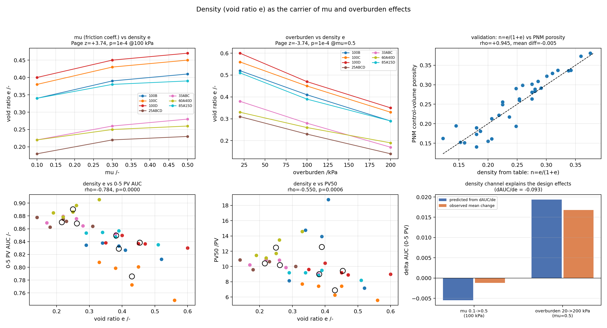

# 70个算例结果报告：宏观输入参数 → 孔隙结构 → 气泡微观分布 → 耐久性

**报告日期：** 2026年9月17日
**数据范围：** 现有全部 70 个有效算例（35 套孔隙几何 = 7 种级配 × 5 种制样工况，每套几何 2 个渗吸终态）
**输入数据：** 生产结果 `batch70_bubble_durability_v1`（70/70 正常终止）+ 级配曲线表 `PSD-zhangzhe2025.1.22.xlsx`
**分析产物：** `output/analysis/macro_linkage_v1/`（脚本 `scripts/analyze_macro_linkage.py`，只读输入、可一键复现）
**说明：** 本报告只使用**当前已有的 70 个算例**，不含任何新增仿真或假设数据。所有结论均为模型内部结果。

---

## 摘要

1. **70 个算例全部正常收敛**（`main_real_gas_saturation_reached`），无排除、无插值；最大守恒误差 |εN| = 2.95×10⁻¹³、|εV| = 6.51×10⁻¹⁴。
2. **气泡耐久性在样品之间存在 3.5 倍的量级差异**：PV50 范围 5.57–19.43（中位 9.80），0–5 PV 早期保留 AUC 范围 0.748–0.915（中位 0.8475）。
3. **四个设计输入指标 + 一个密度状态量**：Cu、Cc（级配层）、μ（颗粒间摩擦系数）、上覆压力（制样工况层）是四个设计输入；**密实度（孔隙比 e）由用户提供的密实度表给出**，是设计作用于结构的中介状态量。效应总表见 §1.4、§7.4：

| 链条 | 结果 | 强度 |
|---|---|---|
| 级配（Cu、跨度） → 孔隙率 | Cu–孔隙率 ρ = **−0.929**（置换 p=0.006；5 个工况分块内**每块都是 −0.93**） | **强** |
| 孔隙率 → 早期保留 AUC | 组间 ρ = **−0.893**（p=0.007）；组内 ρ = **−0.465**（p=0.005） | **强** |
| 上覆压力 → 孔隙率 → AUC | 围压对孔隙率 Page z = **−3.74**；对 AUC z = **+2.41**（p=0.008）；中介分析显示 AUC 效应**几乎完全由孔隙率承载**（直接效应 0.40 → 0.07） | **强** |
| 级配（Cu） → AUC | ρ = **+0.929**（p=0.005）；控制孔隙率后降到 +0.595（部分中介） | 中强 |
| 孔隙率 → PV50 | 混合样本 ρ = −0.667，但组间 −0.500（p=0.25）、组内 −0.239（p=0.17）**均不显著** | **弱** |
| 密实度 e（用户表格） → AUC | 总 ρ = **−0.784**；组间 **−0.857**；组内 **−0.463**（p=0.005） | **强** |
| μ（摩擦系数） → 密实度 → 耐久性 | μ 显著增大 e（Page z=**+3.74**，p=1×10⁻⁴），但 μ 造成的 Δe 只有围压的 ~1/3（+0.059 vs −0.207），按密度—AUC 剂量关系换算的 ΔAUC 仅 −0.006，低于可检出水平（**修正**：不是"断链"，而是"同一条密度通道、剂量过小"，详见 §7.2–§7.4） | 中（解释性修正） |

4. **注意 Cu 与 Cc 不独立**：Cu–Cc 的 Spearman ρ=−0.714（p=0.071），二者携带大量重叠信息，不能作为两个独立自变量同时进入同一个回归；建议以 Cu 为主指标、Cc 作为级配形状的辅助描述（详见 §1.4）。
5. **微观解释链成立但解释力有限**：结构 → 初始困气形态的关系清楚（组内：孔隙率–活动含气单元 ρ=−0.76、孔隙率–气泡半径 ρ=+0.92、孔隙率–初始 Sg ρ=−0.45），而初始困气形态中**只有气体纵向空间展布和重心与耐久性稳健相关**（对 PV50：总 ρ=−0.701 / 组内 −0.478；重心 −0.539 / −0.515）。熵与 Gini 在组间与组内**符号相反**，不能跨级配使用。
6. **PV50 与 AUC 不能互相替代**：两者对级配的排序不同（例如 100B 的 PV50 最高 12.55 但 AUC 仅 0.829；100D 的 Weibull β≈1.0、λ=13.7 但 PV50 仅 9.43）。建议主指标同时报告两者。
7. **指标语义（已确认）**：`mu` 是 DEM 试样的**颗粒间摩擦系数**；**密实度**由用户提供的表格单独给出，其数值经核验为**孔隙比 e**（`n=e/(1+e)` 与 PNM 孔隙率 ρ=0.945，见 §7.3）。因此 μ 与密实度是两个不同指标，μ 增大使试样变松（e 增大），密实度增大则对应 e 减小。

---

## 0. 工程速查（先看这一页）

> 术语：**Cu**=不均匀系数（`d60/d10`），**Cc**=曲率系数（`d30²/(d10·d60)`），**e**=孔隙比，**n**=孔隙率，**PV50**=损失一半自由气体所需注入孔隙体积，**AUC**=0–5 PV 平均自由气体保留率。统计量含义见 §1.6。

### 0.1 五个工程结论

| # | 结论 | 关键数字 |
|---|---|---|
| 1 | **本批 7 种级配按经典判据（Cu≥5 且 1≤Cc≤3）没有一种是"级配良好"**：3 种均匀级配、2 种连续宽级配、2 种间断级配。所谓"良好级配更耐久"在本数据中并不成立 | 判据与类型见 §1.2 |
| 2 | **真正决定耐久性的是密实度 e（孔隙比）**：e 越大越松 → 早期保留越低 | e–AUC：总 ρ=−0.784、组间 −0.857、组内 −0.463（p=0.005） |
| 3 | **围压（埋深）是最有效的可控因素，且作用完全经由密实度** | 20→200 kPa：e 降低 0.207 → AUC +0.017（观测）、PV50 +0.53 PV；中介分析直接效应 ≈0 |
| 4 | **提高密实度（降低 e）确实有效**：每降低 e 0.10，AUC 约 +0.009、PV50 约 +0.42 PV | 组内剂量关系 dAUC/de=−0.093（p=0.0002）、dPV50/de=−4.19（p=0.35，PV50 不显著） |
| 5 | **μ（颗粒摩擦系数）不是耐久性的直接控制量**：它只通过密实度起作用，而它能造成的 Δe 只有围压的约 1/3 | μ 0.1→0.5：Δe=+0.059 → 预期 ΔAUC −0.006，低于本数据可检出水平 |

### 0.2 工程问题问答（按本批 70 例结果回答）

**Q1 选哪种级配最耐久？**
早期保留（AUC）最好：**60A40D（间断级配，0.890）> 25ABCD（0.870）≈ 33ABC（0.868）**；最差：**100C（0.786）**。半衰寿命（PV50）最好：**100B（12.55）与 60A40D（12.47）**，最差仍是 **100C（6.88）**。
→ 工程上若只能选级配：**含粗料的填充型级配（60A40D 类）整体最优，纯均匀细砂（100C 类）最差**；但"最优"取决于用 PV50 还是 AUC 评价（见 Q6）。

**Q2 加大埋深（上覆压力）有用吗？**
有用，且是本批**唯一具有完整统计证据的可控因素**：围压 20→200 kPa 使 e 降低 0.207，AUC 平均 +0.017（相对 +2.0%）、5 PV 保留率 +0.025～+0.036、PV50 +0.53 PV（相对 +5.8%）。Page 趋势检验 z=+2.41（AUC，p=0.008）、z=+1.87（PV50，p=0.031）。
→ 但要注意：**这是同一级配内的效应**，量级温和（AUC 绝对提升约 2 个百分点）。

**Q3 压实（提高密实度、降低 e）有多大收益？**
按组内剂量关系（7 个级配 35 点）：**e 每降低 0.10 → AUC +0.009（约 +1.1% 相对）、PV50 +0.42 PV**（AUC 关系 p=0.0002；PV50 关系 p=0.35，未达显著）。
→ 相当于：围压从 20 kPa 提到 200 kPa 的效果（Δe=−0.207）≈ **AUC +0.019 的理论值、+0.017 的实测值**。

**Q4 能用 Cu、Cc 直接预测耐久性吗？**
只能粗估，不能定量设计：

| 预测式（组间，n=7） | R² | p | 残差标准差 |
|---|---:|---:|---:|
| `AUC ≈ 0.812 + 0.0108 × Cu` | 0.49 | 0.078 | 0.023 |
| `AUC ≈ 0.816 + 0.0029 × span` | 0.60 | 0.042 | 0.020 |
| `AUC ≈ 0.954 − 0.420 × n`（孔隙率） | **0.72** | **0.016** | 0.017 |
| `PV50 ≈ 9.09 + 0.315 × Cu` | 0.12 | 0.438 | 1.72 PV |
→ **Cu、Cc 对 AUC 有中等解释力（R²≈0.5），对 PV50 几乎没有**；真正的预测变量是**密实度/孔隙率**（R²≈0.7），因此工程上应"用级配选型 + 用密实度控制"两步走，而不是用 Cu 直接算耐久性。

**Q5 级配能不能替代压实？**
部分可以，但机理不同：
- 连续/间断填充型级配（25ABCD、60A40D）通过**降低 e** 提升耐久性（e 0.16–0.18 vs 均匀砂 0.29–0.33）；
- 均匀级配 100B 走的是另一条路：e 偏大（0.286）但 PV50 最高（12.55），靠的是"困气分散度低、气体偏下游"（气体纵向方差 0.082，全批最小档）。
→ 所以**"低 e"不是唯一路径**，选级配时要同时看 e 和困气分布。

**Q6 设计时该用哪个指标？**
建议**同时报告 PV50 与 AUC**，因为二者排序不同：100B 的 PV50 最高（12.55）但 AUC 只 0.829（偏低）；100D 的 Weibull λ 最大（13.72）但 PV50 仅 9.43。原因是曲线形状不同（β 从 1.0 到 1.33）。
→ 若工程目标是"长期残留"，用 PV50；若目标是"早期冲刷期不快速损失"，用 AUC（或 1 PV/5 PV 保留率）。**用终止时间（达到 Sg=0.01 的 PV）做评价是错误的**：它与 PV50 无配对相关（p=0.74）。

**Q7 最差工况是什么？**
**均匀细砂 100C + 最松状态（μ=0.5、20 kPa 围压）**：e=0.56、孔隙率 0.373、PV50=5.57（全批最低）、AUC=0.749。

**Q8 这些结论能直接用于工程设计吗？**
不能直接用于定量设计，原因有三：
1. 级配层有效样本只有 **7 个级配**，且每个工况只有 **1 个 DEM 堆积实现**，无法分离"级配效应"与"试样随机偏差"；
2. 模型闭合物性（Henry 系数、液膜传质系数 kL、界面面积、毛细压力）**尚未实验标定**，所有结论都是"模型内部"的比较；
3. 耐久性以 PV（注入孔隙体积）表达，转化为工程时间需要现场注水量/流速。
→ 可以用于**选型排序与相对比较**，不可用于绝对寿命预测。

### 0.3 剂量—效应换算表（工程讨论可直接引用）

| 控制手段 | 变化量 | 密实度响应 Δe | AUC 响应（观测） | PV50 响应（观测） | 证据强度 |
|---|---|---:|---:|---:|---|
| 上覆压力（埋深） | 20 → 200 kPa | **−0.207** | **+0.017**（+2.0%） | +0.53 PV | 强（Page p=0.008 / 0.031） |
| 密实度（施工压实） | e 降低 0.10 | — | **+0.009**（+1.1%） | +0.42 PV | 中（AUC p=0.0002；PV50 n.s.） |
| 颗粒摩擦 μ | 0.1 → 0.5 | **+0.059** | −0.001（不可检出） | +0.72（噪声） | 弱（趋势不显著） |
| 级配选型 | 均匀砂 → 填充型级配 | e 降低约 0.14–0.21 | +0.04 ～ +0.10（AUC 0.786→0.890） | −0.1 ～ +5.7（排序不一致） | 中（n=7，探索性） |

> 表中"观测"为该组对比在本批 70 例中的平均值；括号内为相对变化。级配选型的 Δe 为组间均值差（如 100C 的 e=0.43 vs 60A40D 的 e=0.25）。

### 0.4 本报告不能回答的问题

| 问题 | 原因 |
|---|---|
| 绝对寿命（多少年/多少天） | 需要现场注水量与标定后的传质参数 |
| 未测试级配/围压组合 | 本批只有 7 级配 × 5 工况，设计不是全因子 |
| 有效粒径 d10 之外的细粒（<0.075 mm）影响 | 级配表从 0.075 mm 起，不含更细颗粒信息 |
| 真实独立气泡数量、气泡合并/再活化 | 模型为静止气泡假设，活动含气单元≠真实气泡 |
| 压实工艺参数（碾压遍数、含水率） | 本批密实度以孔隙比 e 给出，未含施工工艺变量 |

---

## 1. 数据与设计

### 1.1 算例构成

| 项目 | 数量 |
|---|---:|
| 不同孔隙几何 | 35 |
| 级配类型 | 7（100B、100C、100D、25ABCD、33ABC、60A40D、85A15D） |
| 每个级配的制样工况 | 5（μ=0.1/0.3/0.5 @100 kPa；围压 20/100/200 kPa @μ=0.5） |
| PNM-0.6 / PNM-0.8 渗吸终态 | 各 35 |
| 有效运行总数 | 70（全部正常终止，无排除） |
| 完整配对 | 35 |

### 1.2 宏观输入参数（级配指标按土力学定义）

**Cu 是不均匀系数（coefficient of uniformity），Cc 是曲率系数（coefficient of curvature）**，二者都是级配曲线（颗粒级配/粒径分布曲线）的标准形状指标，由筛分或激光粒度试验得到：

```text
Cu = d60 / d10              Cc = (d30)² / (d10 · d60)

其中 d10/d30/d60 = 小于该粒径的颗粒质量占总质量 10%/30%/60% 的粒径（mm），
也叫"限定粒径"（d10）、"中间粒径"（d30）、"控制粒径"（d60）。
```

**土力学含义与判据（工程常用）**：

- `Cu` 反映粒径分布的**范围宽度**：Cu 越大表示粗细颗粒尺寸相差越悬殊、粒径分布越宽；Cu 越小表示颗粒尺寸越集中（均匀土）。工程上常以 **Cu ≥ 5** 作为"级配良好"的必要条件。
- `Cc` 反映级配曲线的**形状（弯曲程度）**：Cc 接近 1 表示曲线在该段近似直线（颗粒分布连续、无缺失粒径）；工程上常要求 **1 ≤ Cc ≤ 3** 作为"级配良好"的第二个条件。
- 因此常规判据是：**Cu ≥ 5 且 1 ≤ Cc ≤ 3 → 级配良好**；Cu < 5 → 均匀级配（级配不良）；间断级配（缺失中间粒径、曲线出现长平台）时 Cu、Cc 会失真，必须另行描述。

本批 7 种级配的各项数值、以及**按上述判据的判定**如下：

| 级配 | d10/mm | d30/mm | d50/mm | d60/mm | d90/mm | **Cu**（不均匀系数） | **Cc**（曲率系数） | 附加指标 span=d90/d10 | 附加指标 gap 粗料 | 曲线类型 | 按 Cu≥5 且 1≤Cc≤3 的判定 |
|---|---:|---:|---:|---:|---:|---:|---:|---:|---:|---|---|
| 100B | 0.303 | 0.423 | 0.499 | 0.543 | 0.757 | 1.80 | 1.09 | 2.50 | 0 | 均匀（单峰窄） | ✗ Cu 不足 |
| 100C | 0.903 | 1.127 | 1.297 | 1.373 | 1.629 | 1.52 | 1.02 | 1.80 | 0 | 均匀（粗粒组） | ✗ Cu 不足 |
| 100D | 1.780 | 2.190 | 2.553 | 2.707 | 3.227 | 1.52 | 1.00 | 1.81 | 0 | 均匀（更粗） | ✗ Cu 不足（Cc 边界） |
| 25ABCD | 0.165 | 0.368 | 0.799 | 1.209 | 2.697 | **7.35** | 0.68 | 16.4 | 0 | 连续宽级配 | ✗ 仅 Cu 满足，Cc<1 |
| 33ABC | 0.154 | 0.258 | 0.498 | 0.652 | 1.460 | 4.25 | 0.67 | 9.5 | 0 | 连续宽级配 | ✗ Cu、Cc 均不满足 |
| 60A40D | 0.125 | 0.180 | 0.254 | 0.585 | 2.957 | 4.67 | 0.44 | **23.6** | **39.4%** | 间断（缺中间粒径） | ✗ 判据不适用 |
| 85A15D | 0.115 | 0.159 | 0.194 | 0.216 | 2.265 | 1.88 | 1.02 | **19.7** | **15.0%** | 间断（缺中间粒径） | ✗ 判据不适用（Cu 失真） |

**两条必须记住的工程结论**：

1. **按经典判据，本批 7 种级配没有一种是"级配良好"**——所以后续对比实质上是"均匀级配 vs 连续宽级配 vs 间断级配"的对比，而不是"良好 vs 不良"的对比；
2. **Cu 无法识别间断级配**：85A15D 的 Cu=1.88 看起来与 100B（1.80）一样"均匀"，但它的曲线在 85% 处有长平台（15% 粗料、span=19.7），实际是"细料+粗料"双峰填充结构。**这类土必须用 span（d90/d10）或 gap 粗料比例补充描述**，否则会得出错误结论。


### 1.2.1 本批级配的工程分类小结

| 类别 | 级配 | 共同特征 | 本批耐久性表现（AUC，两初态平均） |
|---|---|---|---|
| 均匀级配（Cu<5，单峰） | 100B、100C、100D | 粒径集中、孔隙率高（0.29–0.33） | 0.829 / 0.786 / 0.838（100C 最差） |
| 连续宽级配（Cu 大、曲线连续） | 25ABCD、33ABC | 细颗粒填充空隙、孔隙率低（0.18–0.22） | 0.870 / 0.868（最好档） |
| 间断级配（曲线有长平台） | 60A40D、85A15D | 粗料骨架+细料填充、孔隙率 0.16–0.28 | 0.890（最好）/ 0.849 |


### 1.3 分析方法

| 项目 | 方法 |
|---|---|
| 级配效应 | 级配参数在 5 个工况内为常数，有效样本 **n=7**；报告 7 点 Spearman ρ 与**精确置换 p**（5040 次级配标签重排，条件分块保持），并列出 5 个工况分块内的 ρ 以检验稳健性 |
| μ / 围压效应 | 组内有序设计因子，使用 **Page 趋势检验**（7 个级配为区组） |
| 组间 vs 组内 | 按级配中心化后计算 Spearman |
| 中介 | 秩偏相关（探索性） |
| 多重比较 | 报告 FDR(BH) 列（覆盖 45 个检验，偏保守） |

### 1.4 四个设计输入 + 密实度状态量：取值范围与效应总表

Cu 与 Cc 由级配曲线按 `Cu=d60/d10`、`Cc=d30²/(d10·d60)` 逐一级配计算（7 个级配的数值见 §1.2）；μ 是 **DEM 颗粒间摩擦系数**；上覆压力来自制样工况设计；**密实度由用户提供的密实度表给出**（经核验为孔隙比 e，见 §7.3）。效应汇总如下（完整机器可读表：`four_inputs_summary.tsv`、`five_inputs_summary.tsv`）：

| 指标 | 类型 | 本批范围 | 对**密实度 e** | 对孔隙率 | 对 0–5 PV AUC | 对 PV50 | 判读 |
|---|---|---:|---|---|---|---|---|
| **Cu** | 级配（组间，7） | 1.52 – 7.35 | **ρ=−0.964**（p=0.0005） | **ρ=−0.929**（p=0.006） | **ρ=+0.929**（p=0.005） | ρ=+0.536（p=0.227） | Cu 越大（粒径分布越宽）→ e 越小（越密）→ 早期保留越好 |
| **Cc** | 级配（组间，7） | 0.44 – 1.09 | ρ=+0.643（p=0.119） | ρ=+0.714（p=0.085） | **ρ=−0.893**（p=0.014） | ρ=−0.214（p=0.661） | 方向与 Cu 相反（两者共线） |
| **μ** | 摩擦系数（组内，35） | 0.1 – 0.5 | **Page z=+3.74**（p=1×10⁻⁴） | **z=+3.74**（p=1×10⁻⁴） | z=−0.27（p=0.395） | z=0.00（p=0.500） | μ 越大 e 越大（越松）；耐久性无有序效应 |
| **上覆压力** | 埋深（组内，35） | 20 – 200 kPa | **Page z=−3.74**（p=1×10⁻⁴） | **z=−3.74**（p=1×10⁻⁴） | **z=+2.41**（p=0.008） | **z=+1.87**（p=0.031） | 压密（e↓）→ 早期保留与半衰寿命同时提高 |
| **密实度 e** | 状态量（35） | 0.14 – 0.60 | — | ρ=+0.943（与 PNM 孔隙率） | **ρ=−0.784**（p<1×10⁻⁴） | ρ=−0.550（p=0.0006） | e 越大（越松）→ 耐久性越低 |

**四个指标的相互共线性**（级配层，n=7）：

| 指标对 | ρ | p | 说明 |
|---|---:|---:|---|
| Cu — Cc | **−0.714** | 0.071 | 严重共线，不能作为两个独立自变量 |
| Cu — 密实度 e | **−0.964** | 0.0005 | 级配几乎决定了密实度 |
| Cc — 密实度 e | +0.643 | 0.119 | 与上一条反向一致 |
| Cu — span(d90/d10) | +0.821 | 0.023 | Cu 与跨度同向变化 |
| Cc — span | −0.607 | 0.148 | 与上一条一致 |
| Cu — d50 | −0.500 | 0.253 | 不显著 |
| Cc — d50 | +0.286 | 0.535 | 不显著 |

**结论**：Cu 与 Cc 都"能解释"AUC，但它们本质上是同一级配形状信息的两种表达（互为反向）；**建议在论文中以 Cu 作为主指标，Cc 作为形状校核**，不要报告"Cu 和 Cc 都有独立效应"。


### 1.5 物理量速查（符号、单位、含义）

**输入端**

| 符号 | 名称 | 单位 | 定义 / 计算 | 工程含义 |
|---|---|---|---|---|
| d10 / d30 / d50 / d60 / d90 | 级配特征粒径（限定粒径/中间粒径/中值粒径/控制粒径） | mm | 累计通过率分别为 10/30/50/60/90% 对应的粒径 | d50 表示主体颗粒尺寸；d10 反映细粒部分 |
| **Cu** | **不均匀系数** | — | `d60/d10` | 粒径分布**宽度**：越大粗细相差越悬殊 |
| **Cc** | **曲率系数** | — | `d30²/(d10·d60)` | 级配曲线**弯曲程度**：1–3 表示连续、无缺失粒径 |
| span | 粒径跨度（补充指标） | — | `d90/d10` | Cu 对间断级配失真时用它判断跨度 |
| gap 粗料 | 平台粗料比例（补充指标） | % | 级配曲线最长平台之后的粗颗粒质量占比 | 识别间断级配（如 60A40D 的 40%、85A15D 的 15%） |
| μ | 颗粒间摩擦系数 | — | DEM 接触模型参数（材料/表面属性） | 越大颗粒越难重排，制样结果越松 |
| σv | 上覆压力（围压） | kPa | 20 / 100 / 200 | 埋深代理：越深越密实 |
| **e** | **孔隙比（密实度状态量）** | — | `V_孔隙/V_固体`（用户密实度表给出） | e 越小越密实；与耐久性直接相关 |
| n | 孔隙率 | — | `V_孔隙/V_总体积 = e/(1+e)` | 与 e 一一对应；PNM 采用控制体口径 |
| Z | 平均配位数 | — | 每个孔隙平均连接的喉道数 | 网络连通性；本批 3.08–3.36，变化很小 |

**输出端（气泡耐久性）**

| 符号 | 名称 | 单位 | 定义 / 计算 | 工程含义 |
|---|---|---|---|---|
| PV | 注入孔隙体积 | — | 累计注入液体体积 ÷ 样品孔隙体积 | 无量纲的"注水量/时间"坐标，可跨样品比较 |
| R(PV) | 自由气体保留率 | — | `n_g(PV)/n_g,0`（当前自由气体摩尔 ÷ 初始值） | 1=未损失，0.5=损失一半 |
| **PV50** | 半衰注入孔隙体积 | PV | R 降到 0.5 时的 PV | **主耐久性指标**：越大越耐久 |
| **AUC(0–5PV)** | 早期保留曲线面积 | — | `(1/5)∫₀⁵R dPV` | 前 5 PV 的平均保留率：越大早期损失越慢 |
| λ, β | Weibull 尺度、形状参数 | PV、— | `R=exp[−(PV/λ)^β]` | λ=整体衰减快慢；β=曲线形状（β=1 指数型，β>1 后段加速） |
| Sg | 气体饱和度 | — | 孔隙体积中气体占比 | 初始困气量（渗吸终态的结果） |
| 气体重心 | 无量纲纵向位置 | — | 自由气体摩尔加权位置（0=入口，1=出口） | 困气沿流向的位置：越小越靠入口 |
| 气体纵向方差 | — | — | 气体沿流向的加权方差 | 困气分散程度：越大越分散 |
| εN / εV | 摩尔/体积守恒误差 | — | 调整后相对守恒误差 | 数值可信度：本批 ≤ 2.95×10⁻¹³ / 6.51×10⁻¹⁴ |

### 1.6 统计量怎么读（避免误读）

| 统计量 | 含义 | 判读经验 | **不能说明什么** |
|---|---|---|---|
| Spearman ρ | 两变量的**秩相关**：单调同增/同减的强度 | \|ρ\|≥0.7 强、0.5–0.7 中、<0.3 弱 | 不是斜率、不是线性关系、不能证明因果 |
| 置换 p（permutation p） | 若两变量**无关联**，出现"至少这么强"的关联的概率（本报告对 7 个级配做 5040 次标签重排） | p<0.05 视为显著；n=7 时最小可能 p≈0.0002 | p 大 ≠ 无效应，只说明**当前样本量分辨不出** |
| FDR(BH) q 值 | 多重检验下控制假阳性的校正值 | 本报告覆盖 45 个检验，q 值偏保守；q<0.1 仍值得关注 | 校正不改变原始数据与 ρ |
| bootstrap 95% CI | 重抽样得到相关系数的 95% 区间 | 区间跨 0 → 方向未定 | 区间宽度反映样本量，不是测量误差 |
| Page z | **有序趋势检验**（7 个级配作区组、3 个有序水平） | z>1.65 ≈ 单侧 p<0.05；用于"μ 越大/围压越大"这类有序假设 | 只检验单调趋势，不给出具体函数形式 |
| 组间 vs 组内 ρ | 组间=跨级配（材料选择）；组内=同级配内（施工控制） | 两者符号相反时出现 **Simpson 悖论**，必须分开报告 | 混合样本的总相关会同时含两种机制 |
| 偏相关 / 中介系数 a, b, c, c′ | a=输入→中介，b=中介→输出（剔除输入），c=总效应，c′=直接效应 | \|c′\|≪\|c\| 且 c′≈0 → **完全中介**（作用全部经由该中介） | n=7 时中介结果只能作为探索性判断 |
| R² | 线性回归解释的方差比例 | 0.7 表示 70% 的组间差异可由该变量解释 | 高 R² ≠ 因果；n=7 时 R² 波动很大 |

---

## 2. 总体结果：70 个算例的耐久性分布

| 指标 | 最小值 | 中位数 | 最大值 |
|---|---:|---:|---:|
| PV50 /PV | 5.57 | 9.80 | 19.43 |
| 0–5 PV AUC | 0.748 | 0.8475 | 0.915 |
| 终止 PV | 5.74 | 23.39 | 59.31 |
| 终止物理时间 /s | 156.3 | 400.0 | 835.7 |
| Weibull 尺度 λ /PV | 7.94 | 12.65 | 20.88 |
| Weibull 形状 β | 0.960 | 1.296 | 1.371 |

最高 PV50 约为最低值的 **3.5 倍**，样品间差异具有实际量级。按初态分列的保留水平（中位数）：

| 指标 | PNM-0.6 | PNM-0.8 |
|---|---:|---:|
| 1 PV 保留率 | 0.9303 | 0.9399 |
| 5 PV 保留率 | 0.7001 | 0.7258 |
| 终止时保留率 | 0.0589 | 0.0661 |


---

## 3. 结果：PNM-0.6 与 PNM-0.8 的配对差异（35 对）

| 指标 | PNM-0.6 中位 | PNM-0.8 中位 | PNM-0.8 相对变化 | p（未校正） |
|---|---:|---:|---:|---:|
| 初始主域 Sg | 0.2156 | 0.1710 | −18.24% | 1.1×10⁻⁹ |
| 初始自由气体 /mol | 1.64×10⁻⁶ | 1.36×10⁻⁶ | −20.17% | 8.1×10⁻¹⁰ |
| 初始活动含气单元 | 6056 | 4187 | −28.28% | 5.8×10⁻¹¹ |
| 气体 Gini | 0.4321 | 0.4172 | −4.60% | 0.0010 |
| 气体重心 | 0.4801 | 0.4257 | −10.55% | 5.1×10⁻⁷ |
| 归一化气体熵 | 0.9592 | 0.9600 | +0.31% | 0.75（不显著） |
| **PV50 /PV** | 9.331 | 10.052 | **+7.24%** | 1.28×10⁻⁴ |
| **0–5 PV AUC** | 0.8439 | 0.8608 | **+1.54%** | 6.6×10⁻⁷ |
| Weibull λ | 12.219 | 13.032 | +7.13% | 2.2×10⁻⁵ |
| Weibull β | 1.2956 | 1.3028 | +0.40% | 0.051（边界） |
| 终止 PV | 22.24 | 24.27 | +1.91% | 0.74（不显著） |

PV50 配对差值的 95% bootstrap 区间为 +0.025～+1.038 PV；AUC 为 +0.0057～+0.0196。
**结果**：渗吸更充分（PNM-0.8）的困气总量更少，但剩余气体需要更多注入孔隙体积才能损失一半；终止 PV 不随配对变化，说明**终止时间不能替代自由气体耐久性指标**。


---

## 4. 结果：级配参数 → 孔隙结构

| 关系 | ρ（n=7） | 置换 p | 5 个工况分块内的 ρ | FDR |
|---|---:|---:|---|---:|
| **Cu — 孔隙率** | **−0.929** | **0.006** | 全部为 −0.93 | 0.095 |
| **span — 孔隙率** | **−0.857** | **0.023** | 全部为 −0.86 | 0.142 |
| Cc — 孔隙率 | +0.714 | 0.085 | 全部为 +0.71 | 0.256 |
| d50 — 孔隙率 | +0.643 | 0.141 | 全部为 +0.64 | 0.374 |
| Cu — 平均配位数 | −0.536 | 0.240 | — | 0.412 |
| span — 平均配位数 | −0.321 | 0.501 | — | 0.594 |

**结果**：Cu（不均匀系数）越大、或粒径跨度 span 越大，堆积越密实；该关系在 5 个工况中**逐块一致**。窄级配的 100C/100D 孔隙率高达 0.32–0.33，而含粗料的 60A40D、25ABCD 降到 0.16–0.18。
**同时**：平均配位数全批仅 3.08–3.36，与级配参数不显著相关——级配差异主要通过**孔隙率/孔隙尺度的变化**传递，而不是通过配位数（拓扑连通性）传递。


---

## 5. 结果：孔隙结构 → 气泡耐久性

| 输出 | 总相关（n=35） | 组间（n=7） | 组内（n=35，中心化） |
|---|---:|---:|---:|
| AUC ~ 孔隙率 | **−0.868**（p<1×10⁻⁴） | **−0.893**（p=0.007） | **−0.465**（p=0.005） |
| PV50 ~ 孔隙率 | −0.667（p<1×10⁻⁴） | −0.500（p=0.253） | −0.239（p=0.167） |

**结果**：

- 孔隙率对**早期保留（AUC）**的效应在组间与组内**方向一致且均显著**，是本报告最可靠的"结构→耐久性"结果；
- 孔隙率对 **PV50** 的显著相关只出现在跨级配的混合样本中，拆开后两侧都不显著 → "孔隙率决定 PV50"在本数据中**不成立**。

**PV50 与 AUC 排序不一致的原因（Weibull 形状）**：

| 级配 | Weibull β | Weibull λ | PV50 | AUC |
|---|---:|---:|---:|---:|
| 100B | 1.327 | 10.06 | **12.55（最高）** | 0.829（偏低） |
| 100D | 0.998 | **13.72（最高）** | 9.43 | 0.838 |
| 100C | 1.021 | 9.85 | 6.88 | 0.786 |
| 60A40D | 1.238 | 16.60 | 12.47 | **0.890（最高）** |

β≈1 的 100D 呈"前快后慢"衰减，λ 最大但 PV50 中等；β≈1.33 的 100B 呈"前慢后快"衰减，PV50 最高但早期保留一般。**指标选择会改变样品排名**，建议同时报告 PV50 与 AUC。

**用用户密实度表（孔隙比 e）替换 PNM 孔隙率后结论一致**：e–AUC 总 −0.784、组间 −0.857、组内 −0.463（p=0.005）；e–PV50 总 −0.550、组间 −0.464（p=0.29）、组内 −0.183（p=0.29）。即"密度 → 早期保留"稳健，"密度 → PV50"仍弱（详见 §7.4）。


---

## 6. 结果：宏观输入 → 耐久性（直接关联与中介）

| 关系 | ρ（n=7） | 置换 p | FDR |
|---|---:|---:|---:|
| **Cu — AUC** | **+0.929** | **0.005** | 0.095 |
| **span — AUC** | **+0.857** | **0.021** | 0.142 |
| **Cc — AUC** | **−0.893** | **0.014** | 0.129 |
| Cu — PV50 | +0.536 | 0.227 | 0.412 |
| span — PV50 | +0.393 | 0.389 | 0.547 |
| d50 — Sg | −0.929 | 0.010 | 0.109 |
| d50 — 气体重心 | +0.821 | 0.034 | 0.142 |
| span — 气体重心 | **−1.000** | **0.0004** | 0.018 |

**中介（秩偏相关，探索性）**：

| 链条 | a（输入→结构） | b（结构→输出） | 总效应 c | 直接效应 c′ | 判读 |
|---|---:|---:|---:|---:|---|
| Cu → 孔隙率 → AUC | −0.929 | −0.893 | +0.929 | +0.595 | 部分中介 |
| span → 孔隙率 → AUC | −0.857 | −0.893 | +0.857 | +0.396 | 部分中介 |
| 围压 → 孔隙率 → AUC（组内，n=35） | −0.787 | −0.465 | +0.403 | **+0.067** | **完全中介** |
| 围压 → 孔隙率 → PV50（组内，n=35） | −0.787 | −0.239 | +0.166 | −0.038 | 不显著 |

**结果**：级配与围压对**早期保留 AUC** 的作用有相当部分（级配）或几乎全部（围压）通过孔隙率实现；对 PV50 的传递则不成立。

### 6.1 四个指标并非独立：Cu/Cc 会改变 μ 与围压的效应强度

做法：对每个级配单独拟合组内敏感度——`∂n/∂μ`（100 kPa 下 3 个 μ 水平）、`∂n/∂log10(围压)`（μ=0.5 下 20/100/200 kPa），再把 7 个级配的敏感度与 Cu、Cc 做 Spearman 相关（n=7，探索性）。

| 组内敏感度 | 7 个级配的取值范围 | 与 Cu 的 ρ | 与 Cc 的 ρ | 判读 |
|---|---:|---:|---:|---|
| `∂n/∂μ`（疏松速率） | +0.052 ～ +0.080（7/7 为正） | +0.107（p=0.82） | −0.214（p=0.65） | μ 的疏松作用**与级配无关**，几乎是普适的 |
| `∂n/∂log σ`（压密速率） | −0.083 ～ −0.043（7/7 为负） | **+0.750（p=0.052）** | **−0.714（p=0.071）** | Cu/span 越大，围压压密效果越强 |
| `∂AUC/∂log σ` | −0.019 ～ +0.062（6/7 为正） | −0.571（p=0.18） | **+0.821（p=0.023）** | Cc 接近 1 的窄级配，从压密中获得的早期保留增益更大 |
| `∂PV50/∂log σ` | −2.87 ～ +3.72（6/7 为正） | −0.464（p=0.29） | +0.750（p=0.052） | 同方向 |
| `∂AUC/∂μ` | −0.037 ～ +0.044 | +0.500（p=0.25） | −0.250（p=0.59） | μ 对 AUC 无稳定效应（与 §7.2 一致） |
| `∂PV50/∂μ` | −3.87 ～ +10.03 | +0.393（p=0.38） | +0.143（p=0.76） | 同上 |

**结果**：

1. **μ 的效应与级配无关**——所有 7 个级配都以几乎相同的速率被 μ 疏松（Δn≈+0.028，当 μ 从 0.1 升到 0.5），但都不转化为耐久性变化；
2. **围压的效应与级配有关**——级配越好（Cu 大、Cc 小），压密速率越大；窄级配（Cc≈1）从压密获得的 AUC 增益更大；
3. **唯一的例外是 60A40D**：它的 `∂AUC/∂log σ = −0.019`、`∂PV50/∂log σ = −2.87`，即这个间断级配（40% 粗料、孔隙率最低 0.16）在加压后早期保留反而略降，是所有级配中唯一符号相反者。

该结果为探索性（每个敏感度只由 3 个组内点估计、n=7），但方向与"级配控制结构、结构控制暴露"的总体图景一致。

**加入密实度（e）后的同类调节结果**（`density_sensitivity_vs_gradation.tsv`）：

| 密实度敏感度 | 7 个级配取值 | 与 Cu | 与 Cc |
|---|---:|---:|---:|
| ∂e/∂μ | +0.100 ～ +0.175（7/7 为正） | **−0.764（p=0.046）** | +0.673（p=0.098） |
| ∂e/∂log σ | −0.239 ～ −0.133（7/7 为负） | **+0.857（p=0.014）** | −0.750（p=0.052） |

即：**Cu 越大（粒径分布越宽），摩擦对密实度的影响越小（∂e/∂μ 越接近 0），而围压的压密效果越强**。这与"细颗粒填充使粗颗粒骨架更稳定、摩擦敏感性下降，但对围压更敏感"的图像一致，也解释了为什么 μ 通道的耐久性效应更弱。

### 6.2 两个"同样耐久、机理不同"的典型样品

| 样品 | 孔隙率 | PV50 | AUC | 初始 Sg | 气体纵向方差 | 气体重心 |
|---|---:|---:|---:|---:|---:|---:|
| 100B（窄级配） | 0.286 | 12.55 | 0.829 | 0.194 | 0.082 | 0.450 |
| 60A40D（间断级配） | 0.160 | 12.47 | 0.890 | 0.201 | 0.077 | 0.433 |

两者耐久性接近但路径不同：100B 靠"高孔隙率但冲刷暴露低"，60A40D 靠"低孔隙率+困气集中于入口侧"。

---

## 7. 结果：设计因子 μ 与上覆压力


### 7.1 上覆压力（埋深代理）——正向、且被孔隙率完全中介

| 变量 | Page L | z | p（单调上升） |
|---|---:|---:|---:|
| 孔隙率 | 70 | **−3.74** | 1.0×10⁻⁴（随围压下降） |
| AUC | 93 | **+2.41** | **0.008** |
| PV50（合并） | 91 | **+1.87** | **0.031** |
| PV50（PNM-0.6 / 0.8） | 92 / 92 | +2.14 / +2.14 | 0.016 / 0.016 |
| 5 PV 保留率（0.6 / 0.8） | 94 / 93 | +2.67 / +2.41 | 0.004 / 0.008 |
| 初始 Sg | 94 | +2.67 | 0.004（围压越大困气越多） |

水平中位 PV50（PNM-0.8）：20 kPa 8.96 / 100 kPa 10.41 / 200 kPa 10.02。

### 7.2 μ（颗粒间摩擦系数）与密实度 e：同一条通道，不同剂量

| 变量 | Page z | p | 结果 |
|---|---:|---:|---|
| 密实度 e（用户表格） | **+3.74** | 1.0×10⁻⁴ | μ 越大 e 越大（越松） |
| 孔隙率 | **+3.74** | 1.0×10⁻⁴ | μ 越大越松 |
| AUC | −0.27 | 0.61 | 无有序效应 |
| PV50（合并 / 0.6 / 0.8） | 0.00 / +0.80 / +0.27 | 0.50 / 0.21 / 0.39 | 无有序效应 |
| 初始 Sg | −0.53 | 0.30 | 无显著趋势 |

同一批 100 kPa 工况下，μ 由 0.1 升到 0.5 使孔隙比 e 系统性上升 **+0.059**（7 个级配无一例外），但耐久性没有可检出的有序变化。

**这**不是**"链条断开"，而是剂量不足**：把组内剂量关系算出来（`density_dose_response.tsv`）：

| 设计变化 | Δe | 观测 ΔAUC | 由密度通道预测的 ΔAUC（dAUC/de=−0.093） | 判读 |
|---|---:|---:|---:|---|
| μ 0.1→0.5（100 kPa） | **+0.059** | −0.0012 | −0.0055 | 方向一致，但量级小到不可检出 |
| 上覆压力 20→200 kPa（μ=0.5） | **−0.207** | +0.0168 | +0.0194 | **预测与观测吻合（87%）** |

即：**μ 与围压走的是同一条密实度通道**，只是 μ 能造成的密实度变化量只有围压的约 **1/3**，对应的耐久性响应落在 70 例数据的噪声水平之下。围压的效应则大到足以稳定检出，且被密实度**完全中介**（见 §7.4）。

### 7.3 密实度数据来源、核验与语义（重要更正）

用户提供的密实度表（`/workspace/zz/级配曲线数据/密实度.png`，sha256 `3548dce2…75be`）转录如下（行=级配，列=样本序号 1–5）：

| 级配 | ① μ=0.1, 100 kPa | ② μ=0.3, 100 kPa | ③ μ=0.5, 20 kPa | ④ μ=0.5, 100 kPa | ⑤ μ=0.5, 200 kPa |
|---|---:|---:|---:|---:|---:|
| 25ABCD | 0.18 | 0.22 | 0.31 | 0.23 | 0.14 |
| 33ABC | 0.22 | 0.26 | 0.38 | 0.28 | 0.17 |
| 60A40D | 0.22 | 0.25 | 0.33 | 0.26 | 0.19 |
| 85A15D | 0.34 | 0.38 | 0.51 | 0.39 | 0.29 |
| 100B | 0.34 | 0.39 | 0.52 | 0.41 | 0.29 |
| 100C | 0.38 | 0.43 | 0.56 | 0.45 | 0.33 |
| 100D | 0.40 | 0.45 | 0.60 | 0.47 | 0.35 |

**列序判定依据**：100B 行与 5 个算例目录名中的 e 值逐一对应（`e-0.34 / e-0.39 / e-0.41 / e-0.29 / e-0.52`）；且每一行的最大值都落在第③列（20 kPa，最松）、最小值都落在第⑤列（200 kPa，最密），与设计完全一致。

**数值语义核验**：表格数值为**孔隙比 e**（不是孔隙率，也不是相对密实度 Dr）。判据：`n = e/(1+e)` 与 PNM 控制体孔隙率的 Spearman ρ=**0.945**，平均偏差 −0.005，最大偏差 0.055（偏差最大的是最密的 200 kPa 试样，PNM 控制体孔隙率系统性略高于 DEM 全局孔隙比，属提取尺度差异）。因此：

> **密实度越大 ⇔ e 越小 ⇔ 孔隙率越小**；若论文中以"密实度"为正向指标，建议直接用 `n=e/(1+e)` 或相对密实度表述，避免与 e 的符号混淆。

### 7.4 密实度作为中介：围压完全经密实度起作用

| 链条（组内，n=35 中心化） | a（→e） | b（e→输出） | 总效应 c | 直接效应 c′ | 判读 |
|---|---:|---:|---:|---:|---|
| 上覆压力 → e → AUC | −0.877 | −0.463 | +0.403 | **−0.007** | **完全中介** |
| μ → e → AUC | +0.329 | −0.463 | −0.181 | −0.035 | 总效应本身不显著 |
| 上覆压力 → e → PV50 | −0.877 | −0.183 | +0.166 | +0.010 | 不显著 |
| e → PNM 孔隙率 → AUC | +0.943 | −0.465 | −0.463 | −0.083 | 密实度与 PNM 孔隙率是同一条信息在两个尺度上的表达 |

**密实度—耐久性**（`density_durability_links.tsv`）：

| 输出 | 总（35） | 组间（7） | 组内（35） |
|---|---:|---:|---:|
| AUC ~ e | **−0.784**（p<1×10⁻⁴） | **−0.857**（p=0.014） | **−0.463**（p=0.005） |
| PV50 ~ e | −0.550（p=0.0006） | −0.464（p=0.294） | −0.183（p=0.292） |



### 7.5 μ 的方向小结（原"数据方向说明"）

```text
100B（本批唯一完整记录 e 值的级配）：
mu=0.1 -> e=0.34 -> 孔隙率 0.2635
mu=0.3 -> e=0.39 -> 孔隙率 0.2836
mu=0.5 -> e=0.41 -> 孔隙率 0.2913
mu=0.5, 20 kPa  -> e=0.52 -> 孔隙率 0.3369
mu=0.5, 200 kPa -> e=0.29 -> 孔隙率 0.2560
```

全部 7 个级配均表现为：**μ 越大 e 越大（更松）**、**围压越大 e 越小（更密）**。μ 是 DEM 颗粒间摩擦系数（用户确认），密实度由独立表格给出，两者不是同一个指标：μ 通过改变 e 影响结构，而 e 本身才是与耐久性直接相关的状态量。

---

## 8. 结果：气泡微观分布（结构 → 困气形态 → 耐久性）

### 8.1 结构对初始困气形态的影响

| 关系 | 总相关 ρ | 组内 ρ |
|---|---:|---:|
| 孔隙率 — 初始 Sg | −0.638（p<1×10⁻⁴） | **−0.454（p=0.006）** |
| 平均配位数 — 初始 Sg | −0.756（p<1×10⁻⁴） | **−0.574（p=0.0003）** |
| 孔隙率 — 气泡中值半径 | +0.082（n.s.） | **+0.916（p<1×10⁻⁴）** |
| 孔隙率 — 活动含气单元数 | −0.223（n.s.） | **−0.764（p<1×10⁻⁴）** |
| 孔/喉平均半径 — 活动含气单元数 | −0.769 / −0.754（p<1×10⁻⁴） | −0.774 / −0.771（p<1×10⁻⁴） |

**结果**：越松、孔喉越大的堆积 → 困气单元数更少、单体更大、总困气量（Sg）更低。

### 8.2 困气形态对耐久性的影响

| 关系 | 总相关 ρ | 组内 ρ |
|---|---:|---:|
| **气体纵向方差 — PV50** | **−0.701（p<1×10⁻⁴）** | **−0.478（p=0.004）** |
| 气体重心 — PV50 | −0.539（p=0.001） | −0.515（p=0.002） |
| 气体纵向方差 — AUC | −0.595（p<1×10⁻⁴） | −0.397（p=0.018） |
| 气体重心 — AUC | −0.588（p<1×10⁻⁴） | −0.406（p=0.015） |
| 初始 Sg — AUC | +0.655（p<1×10⁻⁴） | +0.504（p=0.002） |
| 归一化熵 — AUC | +0.209（n.s.） | **−0.568（p=0.0004）** |
| Gini — AUC | −0.235（n.s.） | **+0.643（p<1×10⁻⁴）** |

**结果**：

- **气体纵向展布是 PV50 最强的单一相关量**（−0.70），且方向在组间组内一致；重心次之；
- 熵/Gini 在组间与组内**符号相反**（Simpson 悖论），不可跨级配混合解释，应在同级配内使用；
- 级配层：7 个级配的气体重心被 span **完全排序**（span 1.80→23.6 对应重心 0.496→0.433），说明**级配通过结构控制了困气的空间格局**。


---

## 9. 结果汇总表（按证据强度）

| # | 结果 | 关键统计量 | 强度 |
|---|---|---|---|
| 1 | 样品间耐久性差异达 3.5 倍 | PV50 5.57–19.43 | 强（描述性） |
| 2 | Cu（不均匀系数）越大/跨度越大 → 孔隙率与孔隙比 e 越低 | Cu–e ρ=−0.964、Cu–n ρ=−0.929、span–n ρ=−0.857，分块逐块一致 | 强（n=7 探索） |
| 3 | 孔隙率越低 → 早期保留 AUC 越高 | 组间 −0.893、组内 −0.465 | 强 |
| 4 | 围压越高 → 孔隙率越低 → AUC 越高 | Page z=−3.74 / +2.41；完全中介 | 强（组内设计） |
| 5 | PNM-0.8 气体更少但更耐久 | PV50 +7.24%（p=1.3×10⁻⁴） | 强（35 配对） |
| 6 | **密实度 e 是核心状态量**：e 越大（越松）→ 耐久性越低 | e–AUC 总 −0.784 / 组间 −0.857 / 组内 −0.463 | 强 |
| 7 | 围压经密实度**完全中介**作用于早期保留 | 围压→e a=−0.877；e→AUC b=−0.463；直接效应 c′=−0.007 | 强 |
| 8 | μ 与围压走同一条密实度通道，但 μ 剂量仅 1/3 | Δe：μ 0.1→0.5 为 +0.059；围压 20→200 kPa 为 −0.207；剂量换算 ΔAUC −0.006 vs +0.019（观测 +0.017） | 中（解释性修正） |
| 9 | 气体纵向展布越小 → PV50 越大 | 总 −0.701 / 组内 −0.478 | 中 |
| 10 | 级配控制困气空间格局 | span–重心 ρ=−1.000（p=0.0004） | 中（n=7） |
| 11 | 孔隙率/e → PV50 的直接效应 | 组间 −0.46 ～ −0.50、组内 −0.18 ～ −0.24（均 n.s.） | **弱/不成立** |
| 12 | 平均孔径、平均喉径、活动含气单元数 → 耐久性 | 单变量相关接近 0 或组间组内不一致 | **不成立** |
| 13 | Cu 与 Cc 高度共线，不是两个独立自变量；且按经典判据（Cu≥5 且 1≤Cc≤3）本批 7 种级配无一"级配良好" | ρ=−0.714（p=0.071）；分类见 §1.2 | 数据说明 |
| 14 | 级配调节 μ/围压的密实度敏感度 | ∂e/∂μ vs Cu −0.764（p=0.046）；∂e/∂log σ vs Cu +0.857（p=0.014） | 弱（n=7 探索） |

---

## 10. 数值可信度

| 审计项 | 结果 |
|---|---|
| 终止原因 | 70/70 均为 `main_real_gas_saturation_reached` |
| 最大摩尔守恒误差 \|εN\| | 2.95×10⁻¹³ |
| 最大体积守恒误差 \|εV\| | 6.51×10⁻¹⁴ |
| 最大缩放残量 max residual_scaled_inf | 1.00×10⁻⁸（低于硬阈值） |
| 排除项 | 0（无插值、无邻近样品替代） |
| 消失事件统计 | 生存表 381,870 行；批量退休 224,142；精确定位 579；右删失 157,149 |

---

## 11. 结论适用范围

1. 本报告结论适用于**当前 7 种级配 × 5 种制样工况**的范围内，不外推到未计算的级配或围压组合。
2. 级配层的有效样本量为 **7**，FDR 校正后部分 q 值处于 0.10–0.14；相关结论为**探索性**，其可信度依据是"置换检验 + 5 个工况分块一致性 + 组间/组内方向一致性"三重交叉验证。
3. 每种工况目前只有 **1 个 DEM 堆积实现**，因此无法把"级配效应"与"单个试样随机偏差"分离；这是当前数据最主要的局限。
4. 全部结果为**模型内部数值结果**：Henry 系数、液膜传质系数、界面面积闭合、毛细压力模型、相对导流与静止气泡假设仍未实验标定。
5. `active_bubble_count` 是活动含气控制体数，不是经三维连通聚类识别的真实气泡数；批量退休事件时刻为接受步内的估计值。
6. 初始困气形态由两个渗吸终态（PNM-0.6 / PNM-0.8）给出，尚不能连续刻画饱和度路径的影响。

---

## 12. 数据与复现

```text
生产/耐久性统计 : output/analysis/batch70_bubble_durability_v1/
宏观关联分析     : output/analysis/macro_linkage_v1/
密实度输入分析   : output/analysis/density_inputs_v1/
分析脚本         : scripts/analyze_macro_linkage.py、scripts/analyze_density_inputs.py
级配原始表(只读) : /workspace/zz/级配曲线数据/PSD-zhangzhe2025.1.22.xlsx
密实度原始图(只读): /workspace/zz/级配曲线数据/密实度.png（sha256 3548dce2…75be）
```

```bash
# 宏观关联分析（只读，不重新仿真）
python3 scripts/analyze_macro_linkage.py \
  --psd "/workspace/zz/级配曲线数据/PSD-zhangzhe2025.1.22.xlsx" \
  --batch70 output/analysis/batch70_bubble_durability_v1 \
  --output output/analysis/macro_linkage_v1

# 密实度（孔隙比 e）输入分析（含 μ/围压 → e → 耐久性 的剂量—响应与中介）
python3 scripts/analyze_density_inputs.py \
  --macro output/analysis/macro_linkage_v1 \
  --output output/analysis/density_inputs_v1
```

主要文件：

| 文件 | 内容 |
|---|---|
| `gradation_parameters.csv` | 7 个级配的 d10–d90、Cu、Cc、span、gap |
| `four_inputs_summary.tsv` | **四个核心输入指标**（Cu、Cc、μ、上覆压力）对孔隙率/AUC/PV50 的效应总表 |
| `input_collinearity.tsv` | 级配层输入指标之间的共线性（Cu–Cc 等） |
| `per_gradation_sensitivities.csv` / `moderation_of_within_gradation_effects.tsv` | 各试样的组内敏感度，以及 Cu/Cc 对这些敏感度的调节作用 |
| `density_inputs_v1/density_table_from_image.csv` | 用户密实度表（孔隙比 e）的转录与工况映射 |
| `density_inputs_v1/density_master.csv` | 35 套几何的 e、n=e/(1+e)、PNM 孔隙率与耐久性合并主表 |
| `density_inputs_v1/validation_density_vs_pnm_porosity.tsv` | 密实度表与 PNM 孔隙率的一致性核验 |
| `density_inputs_v1/density_durability_links.tsv` | e → AUC/PV50 的总/组间/组内相关 |
| `density_inputs_v1/density_mediation_chains.tsv` | μ/围压 → e → 耐久性 中介链 |
| `density_inputs_v1/density_dose_response.tsv` | Δe 剂量—响应（预测 vs 观测） |
| `density_inputs_v1/density_sensitivity_vs_gradation.tsv` | ∂e/∂μ、∂e/∂log σ 与 Cu/Cc 的调节关系 |
| `density_inputs_v1/five_inputs_summary.tsv` | **五个核心指标**（Cu、Cc、μ、上覆压力、密实度 e）效应总表 |
| `geometry_master.csv` / `gradation_master.csv` | 35 套几何 / 7 个级配的主表 |
| `gradation_vs_structure_durability.tsv` | 级配参数 45 组关联（ρ、置换 p、FDR） |
| `block_consistency.tsv` | 每条关联在 5 个工况内的 ρ |
| `ordered_trend_tests.tsv` | μ 与围压的 Page 趋势检验 |
| `porosity_durability_decomposition.tsv` | 总数/组间/组内分解 + bootstrap CI |
| `structure_gas_durability_links.tsv` | 结构→困气→耐久性链条 |
| `mediation_chains.tsv` | 中介链 a/b/c/c′ |
| `analysis_manifest.json` | 输入与输出 SHA-256（含脚本自身哈希） |

---

## 附录 A　级配层主表（7 行）

| 级配 | d50/mm | Cu | Cc | span | gap 粗料/% | 孔隙率 | 配位数 | 初始Sg | 气体纵向方差 | 气体重心 | 气体熵 | Gini | PV50(0.6) | PV50(0.8) | AUC(0.6) | AUC(0.8) |
|---|---:|---:|---:|---:|---:|---:|---:|---:|---:|---:|---:|---:|---:|---:|---:|---:|
| 100B | 0.499 | 1.79 | 1.09 | 2.5 | 0.0 | 0.286 | 3.10 | 0.194 | 0.082 | 0.450 | 0.971 | 0.376 | 12.40 | 12.71 | 0.822 | 0.836 |
| 100C | 1.297 | 1.52 | 1.02 | 1.8 | 0.0 | 0.323 | 3.36 | 0.064 | 0.111 | 0.496 | 0.811 | 0.786 | 6.94 | 6.83 | 0.786 | 0.785 |
| 100D | 2.553 | 1.52 | 1.00 | 1.8 | 0.0 | 0.331 | 3.30 | 0.072 | 0.146 | 0.486 | 0.863 | 0.694 | 9.34 | 9.51 | 0.836 | 0.841 |
| 25ABCD | 0.799 | 7.35 | 0.68 | 16.4 | 0.0 | 0.177 | 3.12 | 0.193 | 0.086 | 0.445 | 0.939 | 0.482 | 10.29 | 10.52 | 0.867 | 0.873 |
| 33ABC | 0.498 | 4.25 | 0.67 | 9.5 | 0.0 | 0.217 | 3.08 | 0.213 | 0.082 | 0.447 | 0.966 | 0.390 | 9.45 | 10.91 | 0.856 | 0.881 |
| 60A40D | 0.254 | 4.67 | 0.44 | 23.6 | 39.4 | 0.160 | 3.17 | 0.201 | 0.077 | 0.433 | 0.949 | 0.446 | 11.49 | 13.45 | 0.880 | 0.901 |
| 85A15D | 0.194 | 1.88 | 1.02 | 19.7 | 15.0 | 0.283 | 3.14 | 0.216 | 0.086 | 0.436 | 0.976 | 0.344 | 8.45 | 9.53 | 0.839 | 0.860 |

（孔隙率、Sg、气体方差/重心/熵/Gini 为 5 个工况的平均值；PV50/AUC 为各初态下的 5 工况平均值）


## 附录 B　35 套几何的工况明细

| 级配 | μ | 围压/kPa | 孔隙率 | 初始Sg | 气体纵向方差 | 气体重心 | PV50(0.6) | PV50(0.8) | AUC(0.6) | AUC(0.8) |
|---|---:|---:|---:|---:|---:|---:|---:|---:|---:|---:|
| 100B | 0.1 | 100 | 0.263 | 0.205 | 0.079 | 0.458 | 14.65 | 14.84 | 0.834 | 0.842 |
| 100B | 0.3 | 100 | 0.284 | 0.202 | 0.082 | 0.444 | 14.38 | 13.52 | 0.829 | 0.838 |
| 100B | 0.5 | 20 | 0.337 | 0.166 | 0.086 | 0.458 | 6.65 | 7.69 | 0.798 | 0.827 |
| 100B | 0.5 | 100 | 0.291 | 0.191 | 0.077 | 0.431 | 18.08 | 19.43 | 0.814 | 0.839 |
| 100B | 0.5 | 200 | 0.256 | 0.204 | 0.088 | 0.461 | 8.24 | 8.05 | 0.834 | 0.834 |
| 100C | 0.1 | 100 | 0.301 | 0.066 | 0.105 | 0.495 | 7.46 | 7.39 | 0.797 | 0.800 |
| 100C | 0.3 | 100 | 0.322 | 0.062 | 0.108 | 0.500 | 6.29 | 6.26 | 0.772 | 0.773 |
| 100C | 0.5 | 20 | 0.373 | 0.055 | 0.135 | 0.510 | 5.57 | 5.60 | 0.749 | 0.748 |
| 100C | 0.5 | 100 | 0.329 | 0.067 | 0.111 | 0.484 | 7.62 | 7.23 | 0.805 | 0.797 |
| 100C | 0.5 | 200 | 0.290 | 0.068 | 0.098 | 0.493 | 7.73 | 7.67 | 0.808 | 0.808 |
| 100D | 0.1 | 100 | 0.308 | 0.065 | 0.149 | 0.522 | 10.44 | 10.46 | 0.847 | 0.853 |
| 100D | 0.3 | 100 | 0.329 | 0.075 | 0.145 | 0.485 | 9.30 | 9.06 | 0.839 | 0.835 |
| 100D | 0.5 | 20 | 0.381 | 0.065 | 0.157 | 0.500 | 9.01 | 8.96 | 0.830 | 0.830 |
| 100D | 0.5 | 100 | 0.337 | 0.079 | 0.137 | 0.473 | 8.76 | 9.04 | 0.833 | 0.840 |
| 100D | 0.5 | 200 | 0.299 | 0.074 | 0.140 | 0.452 | 9.21 | 10.02 | 0.831 | 0.845 |
| 25ABCD | 0.1 | 100 | 0.152 | 0.181 | 0.087 | 0.448 | 9.77 | 9.43 | 0.865 | 0.861 |
| 25ABCD | 0.3 | 100 | 0.173 | 0.211 | 0.083 | 0.432 | 10.37 | 11.49 | 0.867 | 0.883 |
| 25ABCD | 0.5 | 20 | 0.217 | 0.159 | 0.084 | 0.448 | 9.95 | 10.05 | 0.862 | 0.866 |
| 25ABCD | 0.5 | 100 | 0.181 | 0.205 | 0.086 | 0.448 | 10.46 | 10.81 | 0.868 | 0.875 |
| 25ABCD | 0.5 | 200 | 0.162 | 0.208 | 0.088 | 0.449 | 10.91 | 10.80 | 0.876 | 0.879 |
| 33ABC | 0.1 | 100 | 0.190 | 0.246 | 0.084 | 0.436 | 10.59 | 11.36 | 0.872 | 0.887 |
| 33ABC | 0.3 | 100 | 0.213 | 0.233 | 0.076 | 0.449 | 9.84 | 11.82 | 0.863 | 0.889 |
| 33ABC | 0.5 | 20 | 0.264 | 0.172 | 0.087 | 0.478 | 7.94 | 10.05 | 0.831 | 0.873 |
| 33ABC | 0.5 | 100 | 0.222 | 0.212 | 0.077 | 0.435 | 9.33 | 10.41 | 0.855 | 0.874 |
| 33ABC | 0.5 | 200 | 0.195 | 0.202 | 0.085 | 0.439 | 9.53 | 10.91 | 0.858 | 0.881 |
| 60A40D | 0.1 | 100 | 0.141 | 0.219 | 0.075 | 0.452 | 10.62 | 11.61 | 0.872 | 0.885 |
| 60A40D | 0.3 | 100 | 0.155 | 0.181 | 0.083 | 0.450 | 10.88 | 12.56 | 0.876 | 0.897 |
| 60A40D | 0.5 | 20 | 0.193 | 0.191 | 0.066 | 0.375 | 14.15 | 15.03 | 0.899 | 0.912 |
| 60A40D | 0.5 | 100 | 0.161 | 0.209 | 0.080 | 0.424 | 11.29 | 15.64 | 0.877 | 0.915 |
| 60A40D | 0.5 | 200 | 0.151 | 0.206 | 0.080 | 0.464 | 10.52 | 12.40 | 0.874 | 0.895 |
| 85A15D | 0.1 | 100 | 0.260 | 0.224 | 0.084 | 0.433 | 8.73 | 9.68 | 0.844 | 0.865 |
| 85A15D | 0.3 | 100 | 0.281 | 0.222 | 0.082 | 0.427 | 8.37 | 9.31 | 0.838 | 0.857 |
| 85A15D | 0.5 | 20 | 0.336 | 0.188 | 0.091 | 0.453 | 7.59 | 8.79 | 0.822 | 0.848 |
| 85A15D | 0.5 | 100 | 0.288 | 0.223 | 0.085 | 0.438 | 8.76 | 10.24 | 0.844 | 0.870 |
| 85A15D | 0.5 | 200 | 0.249 | 0.223 | 0.086 | 0.428 | 8.79 | 9.61 | 0.846 | 0.861 |

## 附录 C　关键统计表

### C.1 级配参数关联（选取）

| 输入 | 输出 | ρ（n=7） | 置换 p | FDR |
|---|---|---:|---:|---:|
| Cu | 孔隙率 | −0.929 | 0.006 | 0.095 |
| Cu | AUC | +0.929 | 0.005 | 0.095 |
| Cu | 气体重心 | −0.821 | 0.031 | 0.142 |
| Cu | PV50 | +0.536 | 0.227 | 0.412 |
| span | 孔隙率 | −0.857 | 0.023 | 0.142 |
| span | AUC | +0.857 | 0.021 | 0.142 |
| span | 气体重心 | −1.000 | 0.0004 | 0.018 |
| Cc | AUC | −0.893 | 0.014 | 0.129 |
| d50 | 初始 Sg | −0.929 | 0.010 | 0.109 |
| d50 | 气体重心 | +0.821 | 0.034 | 0.142 |
| gap 粗料 | 气体重心 | −0.802 | 0.051 | 0.176 |

### C.2 孔隙率—耐久性分解

| 输出 | 层次 | n | ρ | p | 95% CI |
|---|---|---:|---:|---:|---|
| AUC | 总 | 35 | −0.868 | <1×10⁻⁴ | [−0.924, −0.753] |
| AUC | 组间 | 7 | −0.893 | 0.007 | [−1.000, −0.400] |
| AUC | 组内 | 35 | −0.465 | 0.005 | [−0.732, −0.091] |
| PV50 | 总 | 35 | −0.667 | <1×10⁻⁴ | [−0.837, −0.419] |
| PV50 | 组间 | 7 | −0.500 | 0.253 | [−1.000, 0.412] |
| PV50 | 组内 | 35 | −0.239 | 0.167 | [−0.561, 0.140] |

### C.3 中介链

| 链条 | a | b | c | c′ |
|---|---:|---:|---:|---:|
| Cu → 孔隙率 → AUC | −0.929 | −0.893 | +0.929 | +0.595 |
| span → 孔隙率 → AUC | −0.857 | −0.893 | +0.857 | +0.396 |
| 围压 → 孔隙率 → AUC（组内） | −0.787 | −0.465 | +0.403 | +0.067 |
| 围压 → 孔隙率 → PV50（组内） | −0.787 | −0.239 | +0.166 | −0.038 |

### C.4 结构 → 困气 → 耐久性（选取）

| 关系 | 总 ρ | 组内 ρ |
|---|---:|---:|
| 孔隙率 — 初始 Sg | −0.638 | −0.454 |
| 平均配位数 — 初始 Sg | −0.756 | −0.574 |
| 孔隙率 — 气泡中值半径 | +0.082 | +0.916 |
| 孔隙率 — 活动含气单元数 | −0.223 | −0.764 |
| 气体纵向方差 — PV50 | −0.701 | −0.478 |
| 气体重心 — PV50 | −0.539 | −0.515 |
| 气体纵向方差 — AUC | −0.595 | −0.397 |
| 熵 — AUC | +0.209 | −0.568 |
| Gini — AUC | −0.235 | +0.643 |

### C.5 四个设计输入指标（Cu、Cc、μ、上覆压力；密实度 e 见 C.7）

| 指标 | 层次 | 范围 | 输出 | 统计量 | p |
|---|---|---|---|---:|---:|
| Cu | 组间 | 1.52–7.35 | 孔隙率 | ρ=−0.929 | 0.006 |
| Cu | 组间 | 1.52–7.35 | AUC | ρ=+0.929 | 0.005 |
| Cu | 组间 | 1.52–7.35 | PV50 | ρ=+0.536 | 0.227 |
| Cc | 组间 | 0.444–1.09 | 孔隙率 | ρ=+0.714 | 0.085 |
| Cc | 组间 | 0.444–1.09 | AUC | ρ=−0.893 | 0.014 |
| Cc | 组间 | 0.444–1.09 | PV50 | ρ=−0.214 | 0.661 |
| μ | 组内 | 0.1–0.5 | 孔隙率 | Page z=+3.74 | 1×10⁻⁴ |
| μ | 组内 | 0.1–0.5 | AUC | Page z=−0.27 | 0.395 |
| μ | 组内 | 0.1–0.5 | PV50 | Page z=0.00 | 0.500 |
| 上覆压力 | 组内 | 20–200 kPa | 孔隙率 | Page z=−3.74 | 1×10⁻⁴ |
| 上覆压力 | 组内 | 20–200 kPa | AUC | Page z=+2.41 | 0.008 |
| 上覆压力 | 组内 | 20–200 kPa | PV50 | Page z=+1.87 | 0.031 |

（级配层为 7 点 Spearman + 5040 次精确置换检验；组内为 Page 趋势检验，7 个级配为区组。完整表：`four_inputs_summary.tsv`）

### C.6 各试样的组内敏感度（用于 §6.1 的调节分析）

| 级配 | ∂n/∂μ | ∂AUC/∂μ | ∂PV50/∂μ | ∂n/∂log σ | ∂AUC/∂log σ | ∂PV50/∂log σ |
|---|---:|---:|---:|---:|---:|---:|
| 100B | +0.070 | −0.028 | +10.03 | −0.078 | +0.022 | +3.72 |
| 100C | +0.071 | +0.005 | −0.01 | −0.079 | +0.062 | +2.21 |
| 100D | +0.071 | −0.033 | −3.87 | −0.079 | +0.008 | +0.50 |
| 25ABCD | +0.071 | +0.022 | +2.59 | −0.055 | +0.013 | +0.86 |
| 33ABC | +0.080 | −0.037 | −2.77 | −0.068 | +0.018 | +1.23 |
| 60A40D | +0.052 | +0.044 | +5.88 | −0.043 | **−0.019** | **−2.87** |
| 85A15D | +0.070 | +0.006 | +0.74 | −0.083 | +0.020 | +1.16 |

敏感度定义为组内线性斜率（μ 单位：无量纲；围压取 log10，单位：kPa 的十倍程）。μ 与围压的调节检验（敏感度 vs Cu/Cc 的 Spearman）：见 `moderation_of_within_gradation_effects.tsv`。

### C.7 密实度（用户表格）结果

**C.7.1 密实度—耐久性**（完整表：`density_inputs_v1/density_durability_links.tsv`）

| 输出 | 层次 | n | ρ | p | 95% CI |
|---|---|---:|---:|---:|---|
| AUC | 总 | 35 | −0.784 | <1×10⁻⁴ | [−0.870, −0.629] |
| AUC | 组间 | 7 | −0.857 | 0.014 | [−1.000, −0.348] |
| AUC | 组内 | 35 | −0.463 | 0.005 | [−0.723, −0.102] |
| PV50 | 总 | 35 | −0.550 | 0.0006 | [−0.756, −0.250] |
| PV50 | 组间 | 7 | −0.464 | 0.294 | [−1.000, 0.556] |
| PV50 | 组内 | 35 | −0.183 | 0.292 | [−0.519, 0.194] |

**C.7.2 中介链**（`density_mediation_chains.tsv`）

| 链条（组内） | a | b | c | c′ |
|---|---:|---:|---:|---:|
| 上覆压力 → e → AUC | −0.877 | −0.463 | +0.403 | −0.007 |
| μ → e → AUC | +0.329 | −0.463 | −0.181 | −0.035 |
| 上覆压力 → e → PV50 | −0.877 | −0.183 | +0.166 | +0.010 |
| e → PNM 孔隙率 → AUC | +0.943 | −0.465 | −0.463 | −0.083 |

**C.7.3 剂量—响应**（`density_dose_response.tsv`）

| 设计变化 | Δe | dAUC/de（组内） | 预测 ΔAUC | 观测 ΔAUC | 观测/预测 |
|---|---:|---:|---:|---:|---:|
| μ 0.1→0.5 @100 kPa | +0.059 | −0.093 | −0.0055 | −0.0012 | 0.22 |
| 围压 20→200 kPa @μ=0.5 | −0.207 | −0.093 | +0.0194 | +0.0168 | **0.87** |

**C.7.4 密实度敏感度的调节**（`density_sensitivity_vs_gradation.tsv`）

| 敏感度 | 与 Cu | 与 Cc |
|---|---:|---:|
| ∂e/∂μ | −0.764（p=0.046） | +0.673（p=0.098） |
| ∂e/∂log σ | +0.857（p=0.014） | −0.750（p=0.052） |

### C.8 工程用回归与效应量（组间 n=7；组内 n=35）

**C.8.1 组间回归（用于排序与粗估，不可用于定量设计）**

| 预测式 | 样本 | R² | p | 残差标准差 | 用途 |
|---|---|---:|---:|---:|---|
| `AUC ≈ 0.954 − 0.420 × n` | 7 个级配（孔隙率均值） | 0.72 | 0.016 | 0.017 | 密实度是 AUC 最强的单变量预测因子 |
| `AUC ≈ 0.816 + 0.0029 × span` | 7 个级配 | 0.60 | 0.042 | 0.020 | Cu 失真时用 span 更好 |
| `AUC ≈ 0.812 + 0.0108 × Cu` | 7 个级配 | 0.49 | 0.078 | 0.023 | Cu 的中等解释力 |
| `AUC ≈ 0.945 − 0.286 × e` | 7 个级配（e 均值） | 0.64 | 0.030 | 0.019 | 用密实度表直接估计 |
| `PV50 ≈ 9.09 + 0.315 × Cu` | 7 个级配 | 0.12 | 0.438 | 1.72 PV | **不可用**：PV50 与级配几乎无关 |

**C.8.2 组内剂量—效应（施工控制口径）**

| 效应 | 数值 | p | 判读 |
|---|---:|---:|---|
| `dAUC/de`（中心化，35 点） | **−0.093 /单位 e** | 0.0002 | e 每降低 0.10 → AUC +0.0093 |
| `dPV50/de`（中心化，35 点） | −4.19 /单位 e | 0.345 | e 每降低 0.10 → PV50 +0.42 PV（不显著） |
| `de/dlog₁₀σ`（7 个级配均值） | **−0.197 /十倍程** | — | 围压提高一个十倍程（20→200 kPa）→ e 降低 ≈0.20 |
| `de/dμ`（7 个级配均值） | +0.146 /单位 μ | — | μ 从 0.1 升到 0.5 → e 升高 ≈0.06 |

**C.8.3 级配判据与本批分类**

| 级配 | Cu | Cc | Cu≥5 | 1≤Cc≤3 | 类型 | 判定 |
|---|---:|---:|---|---|---|---|
| 100B | 1.79 | 1.09 | ✗ | ✓ | 均匀 | 不满足（Cu 不足） |
| 100C | 1.52 | 1.02 | ✗ | ✓ | 均匀 | 不满足（Cu 不足） |
| 100D | 1.52 | 1.00 | ✗ | 边界 | 均匀 | 不满足（Cu 不足） |
| 25ABCD | 7.35 | 0.68 | ✓ | ✗ | 连续宽级配 | 不满足（Cc<1） |
| 33ABC | 4.25 | 0.67 | ✗ | ✗ | 连续宽级配 | 不满足 |
| 60A40D | 4.67 | 0.44 | ✗ | ✗ | 间断（40% 粗料） | 判据不适用 |
| 85A15D | 1.88 | 1.02 | ✗ | ✓ | 间断（15% 粗料） | 判据失真（Cu 被平台拉低） |

---

## 参考文档

| 文档 | 内容 |
|---|---|
| `docs/70样品气泡耐久性差异统计分析报告_20260917.md` | 70 例耐久性的完整统计报告（配对、级配、工况、结构关联、事件、空间矩） |
| `docs/宏观参数-孔隙结构-气泡耐久性关联分析_20260917.md` | 宏观输入参数的关联与中介分析详版（含方法与探索性说明） |
| `docs/69样品气泡耐久性差异统计分析报告_20260916.md` | 上一版（69 例）报告，保留为历史版本 |
