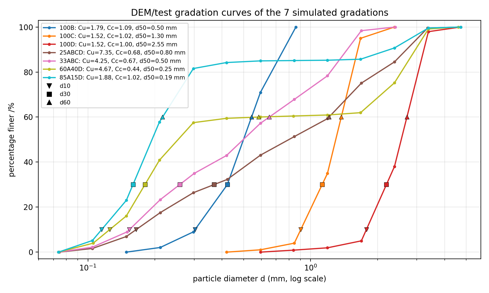
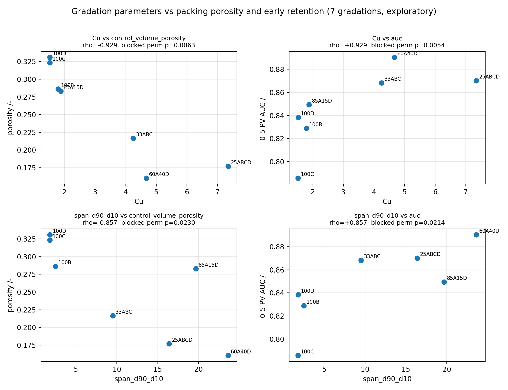
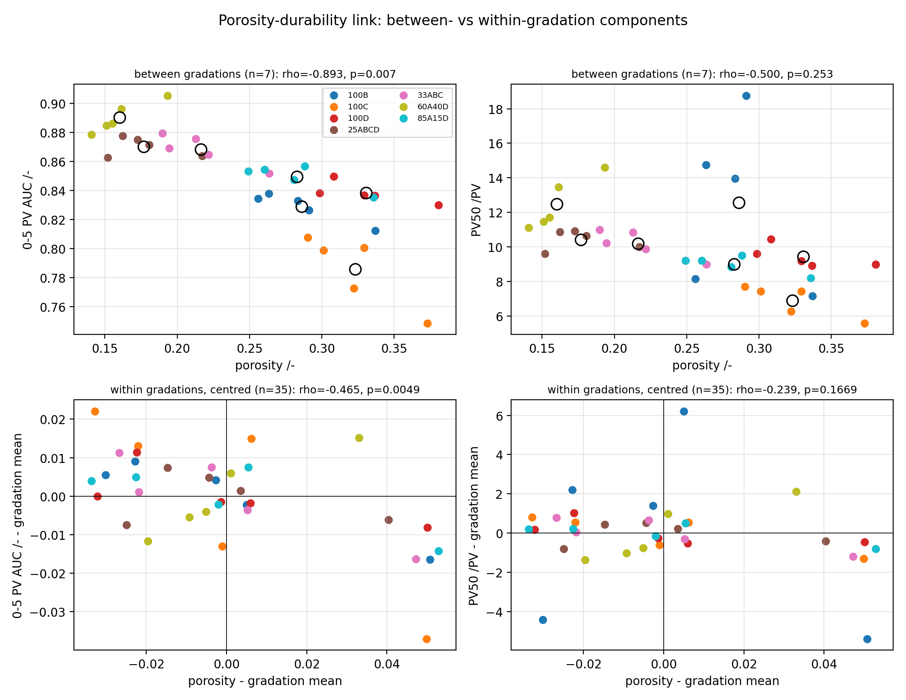
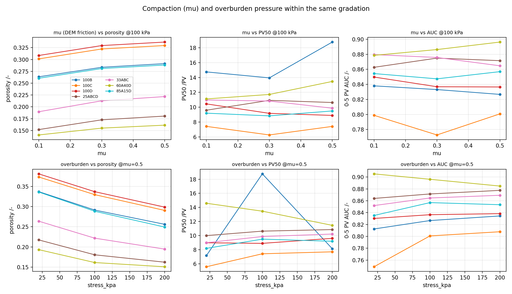
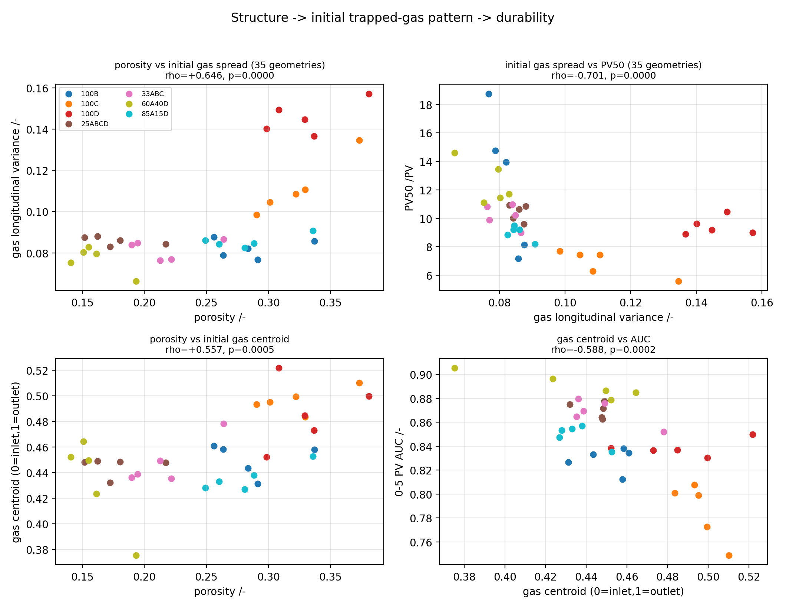
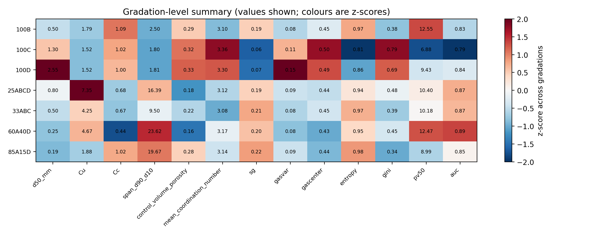

# 宏观输入参数 → 孔隙结构 → 气泡微观分布 → 耐久性 关联分析

**报告日期：** 2026年9月17日
**数据基础：** 70例耐久性统计 `batch70_bubble_durability_v1`（35套几何 = 7种级配 × 5种制样工况）+ 用户提供的级配曲线表 `PSD-zhangzhe2025.1.22.xlsx`
**分析目录：** `output/analysis/macro_linkage_v1/`
**分析脚本：** `scripts/analyze_macro_linkage.py`
**性质：** 观测数据的关联/中介分析，**不是**因果证明；级配层的有效样本只有 **7** 个，全部结论标注为"探索性"

---

## 0. 结论速览

按用户提出的三段链条（宏观输入 → 准静态渗吸 + 溶解模型 → 宏观输出）整理：

```text
级配参数(Cu、Cc、d50、span)
        ↓  ρ = −0.93 (p=0.006，5个工况分块内完全一致)
     孔隙率、孔喉结构
        ↓  孔隙率→AUC: 组间 −0.89 / 组内 −0.47
初始困气形态(Sg、气体纵向展布、重心、团簇尺度)
        ↓  气体纵向展布→PV50: −0.70 (n=35)
     气泡耐久性(PV50 / AUC)
```

| 问题 | 结论 | 证据强度 |
|---|---|---|
| 宏观输入与宏观输出有关联吗？ | **有**，但"级配→孔隙率→**早期保留AUC**"链条最强、跨全部工况分块一致；PV50 的宏观关联明显更弱、更依赖跨级配混合效应 | 中（n=7，探索性） |
| 上覆压力（埋深）有影响吗？ | **有**：组内压实→孔隙率下降→AUC、PV50 上升；AUC 的效应被孔隙率**完全中介**（直接效应 0.40 → 0.07） | 中强（35点组内设计） |
| μ（颗粒摩擦系数）有影响吗？ | μ 越大孔隙率越大（更松），**但耐久性不随之变化**——链条在"结构→耐久性"处断开 | 中（该"断链"本身是明确负结果） |
| 能否用气泡微观分布解释？ | **部分可以**：孔隙率控制初始困气的数量与空间展布；初始气体纵向展布（gasvar）是 PV50 最强的单一相关量；但熵/Gini 在组间与组内符号相反，不能跨级配混用 | 弱-中（相关性证据） |

**必须提醒的一处方向性问题**：在本批数据中，`mu` 是 DEM 三轴试样的**颗粒间摩擦系数**，不是密实度。数据里 μ 越大 → 制样越松 → 孔隙率越大（Page趋势检验 z=+3.74，p=1.0×10⁻⁴），与"μ越大越压实、孔隙度越小"的直觉相反。若不澄清这一点，本报告全部"μ效应"的符号都会被误读。

---

## 1. 输入、中间量、输出的定义

### 1.1 输入（本次新增：级配参数）

级配参数由用户提供的级配曲线表按图中公式计算（Test data 曲线，对数线性插值）：

\[
C_u=\frac{d_{60}}{d_{10}},\qquad
C_c=\frac{(d_{30})^2}{d_{10}\,d_{60}} .
\]

另外计算了 4 个补充描述量：

- `d50`：中值粒径（反映整体粗细）；
- `span = d90/d10`：粒径跨度（对数尺度上的总宽度，能捕捉"间断级配"）；
- `gap_fraction`：最长平台段的粗颗粒质量分数（识别间断/间断-填充型级配）；
- `gap_size_ratio`：平台两端的粒径比。

| 级配 | d10/mm | d30/mm | d50/mm | d60/mm | d90/mm | Cu | Cc | span | gap_fraction | 类型 |
|---|---:|---:|---:|---:|---:|---:|---:|---:|---:|---|
| 100B | 0.303 | 0.423 | 0.499 | 0.543 | 0.757 | 1.80 | 1.09 | 2.50 | 0 | 窄级配 |
| 100C | 0.903 | 1.127 | 1.297 | 1.373 | 1.629 | 1.52 | 1.02 | 1.80 | 0 | 窄级配 |
| 100D | 1.780 | 2.190 | 2.553 | 2.707 | 3.227 | 1.52 | 1.00 | 1.81 | 0 | 窄级配 |
| 25ABCD | 0.165 | 0.368 | 0.799 | 1.209 | 2.697 | 7.35 | 0.68 | 16.4 | 0 | 连续良好级配 |
| 33ABC | 0.154 | 0.258 | 0.498 | 0.652 | 1.460 | 4.25 | 0.67 | 9.5 | 0 | 连续良好级配 |
| 60A40D | 0.125 | 0.180 | 0.254 | 0.585 | 2.957 | 4.67 | 0.44 | 23.6 | 39.4% | 间断级配（40%粗料） |
| 85A15D | 0.115 | 0.159 | 0.194 | 0.216 | 2.265 | 1.88 | 1.02 | 19.7 | 15.0% | 间断级配（15%粗料） |



**读法要点：** Cu 只能刻画"曲率形状"，不能识别间断级配。85A15D 的 Cu=1.88 看似与 100B 一样"均匀"，但它的曲线在 85% 处有一个长平台（span=19.7、15% 粗料），本质是双峰填充结构；60A40D 同理（span=23.6、40% 粗料）。因此本报告把 `span` 与 `gap_fraction` 一起纳入分析。

### 1.2 中间量（模型链中可观测的环节）

| 环节 | 可用观测量 | 来源 |
|---|---|---|
| 颗粒堆积/孔隙结构 | 孔隙率、平均配位数、孔/喉平均半径、收缩比、配位数、估计 Re/Ca | PNM 几何 + 求解器诊断 |
| 准静态渗吸终态（困气形态） | 初始主域 Sg、初始自由气体摩尔、活动含气单元数、气体纵向/横向方差、重心、熵、Gini、气泡半径分位数 | `batch70` 的 `case_metrics.tsv`（由 PNM-0.6 / PNM-0.8 两个渗吸终态给出） |
| 溶解动力学 | 自由气体保留曲线、PV50、AUC、Weibull λ/β | `batch70` |

### 1.3 设计结构与统计口径

- 35 套几何 = 7 级配 × 5 工况（μ=0.1/0.3/0.5 @100 kPa；围压 20/100/200 kPa @μ=0.5）；
- **级配参数在 5 个工况内是常数**，因此级配效应的有效样本量是 **7**，不是 35/70。所有级配层相关都同时给出"7点Spearman ρ"和**精确置换检验 p**（对 7 个级配标签做 7!=5040 次重排，条件分块保持不变）；
- μ 与围压是**组内**有序设计因子，用 **Page 趋势检验**（7 个级配为区组）；
- 组内/组间分解：把变量按级配中心化后计算 Spearman；
- 中介分析：秩偏相关（探索性，n=7 或 35）；
- 多重比较：报告 FDR(BH) 校正列；因其覆盖 45 个检验，**FDR 偏保守**，结论以"分块一致性 + 置换p + 组内/组间一致性"三者共同判断。

---

## 2. 链条一：级配参数 → 孔隙结构

### 2.1 Cu（良好级配程度）→ 孔隙率

| 关系 | ρ（7个级配） | 置换 p | 5个工况分块内的 ρ | FDR |
|---|---:|---:|---|---:|
| Cu — 孔隙率 | **−0.929** | **0.006** | 全部为 −0.93 | 0.095 |
| span — 孔隙率 | **−0.857** | **0.023** | 全部为 −0.86 | 0.142 |
| Cc — 孔隙率 | +0.714 | 0.085 | 全部为 +0.71 | 0.256 |
| d50 — 孔隙率 | +0.643 | 0.141 | 全部为 +0.64 | 0.374 |

**这是整个分析中最稳健的一条关系**：在 5 个工况分块中，Cu 与孔隙率的秩相关**逐块都是 −0.93**，即"级配越良好（或含粗料跨度越大），堆积越密实"。物理上合理：细颗粒填充粗颗粒骨架间的空隙，60A40D 与 25ABCD 的孔隙率降到 0.16–0.18，而窄级配的 100C/100D 高达 0.32–0.33。

### 2.2 但级配几乎不改变化学意义上的"连通性"

平均配位数只有 3.08–3.36（全批），与 Cu（ρ=−0.536，p=0.24）、span（ρ=−0.321，p=0.50）都不显著。也就是说：**渗透率/连通性的变化不是本批级配差异的主要通道**，主要通道是孔隙率（与孔隙体积、孔喉尺寸、流速分布）。



---

## 3. 链条二：孔隙结构 → 气泡耐久性（组间 vs 组内必须分开看）

| 输出 | 总相关（n=35） | 组间（n=7） | 组内（n=35，中心化） |
|---|---:|---:|---:|
| AUC ~ 孔隙率 | **−0.868** (p<1e-4) | **−0.893** (p=0.007) | **−0.465** (p=0.005) |
| PV50 ~ 孔隙率 | −0.667 (p<1e-4) | −0.500 (p=0.253) | −0.239 (p=0.167) |

结论：

1. **早期保留（AUC）与孔隙率的关系在组间和组内同时成立**，方向一致（越密实→早期损失越慢），这是链条中最可靠的环节；
2. **PV50 与孔隙率的关系只在跨级配混合数据里显得很强**（−0.667），拆开后组间（−0.50）和组内（−0.24）都不显著。因此"孔隙率决定 PV50"的说法在本数据中**证据不足**；
3. PV50 与 AUC 的差异不是噪声，而是**曲线形状**差异：100D 的 Weibull β≈1.0、λ=13.7（前快后慢），100B 的 β≈1.33、λ=10.1（前慢后快），于是 100B 的 PV50 最高（12.6）而 AUC 只有 0.829。**选择哪个指标会改变样品排名**（见 §6）。



---

## 4. 链条三：级配参数 → 耐久性（含中介）

| 关系 | ρ（7个级配） | 置换 p |
|---|---:|---:|
| Cu — AUC | **+0.929** | **0.005** |
| span — AUC | **+0.857** | **0.021** |
| Cc — AUC | **−0.893** | **0.014** |
| Cu — PV50 | +0.536 | 0.227 |
| span — PV50 | +0.393 | 0.389 |

即：**良好级配/含粗料跨度大 → 早期保留更好**，但"损失一半气体所需的 PV"没有稳定的级配梯度。

### 4.1 中介链（秩偏相关，n=7，探索性）

| 链条 | a（输入→结构） | b（结构→输出） | 总效应 c | 直接效应 c′ | 判读 |
|---|---:|---:|---:|---:|---|
| Cu → 孔隙率 → AUC | −0.929 | −0.893 | +0.929 | +0.595 | 部分中介：约 1/3 的关联由孔隙率承载 |
| span → 孔隙率 → AUC | −0.857 | −0.893 | +0.857 | +0.396 | 部分中介，直接效应仍较大 |
| Cu → 孔隙率 → PV50 | −0.929 | −0.500 | +0.536 | +0.222 | 不显著，不做解释 |

### 4.2 两个"同样耐久、机理不同"的样本

- **100B**：孔隙率 0.286（中上），PV50=12.55（最高），但 AUC=0.829（偏低）；气体纵向展布窄（gasvar≈0.082）、重心偏向下游（0.450）。
- **60A40D**：孔隙率 0.160（最低），PV50=12.47（次高），AUC=0.890（最高）；间断级配，初始 Sg 高（≈0.20，与 33ABC 的 0.21、85A15D 的 0.22 同档）。

两者说明：**"高孔隙率-低冲刷暴露"与"低孔隙率-低含气量"是两条并行的耐久路径**，不能用单一结构变量同时解释。

---

## 5. 设计因子：μ（颗粒摩擦）与上覆压力



### 5.1 对上覆压力（埋深代理）

| 变量 | Page L | z | p（单调上升） | 说明 |
|---|---:|---:|---:|---|
| 孔隙率 | 70 | **−3.74** | 1.0×10⁻⁴（下降） | 围压越大越密实 |
| AUC | 93 | **+2.41** | **0.008** | 密实→早期保留更好 |
| PV50（两终态合并） | 91 | **+1.87** | **0.031** | 同一方向 |
| PV50（PNM-0.6 / 0.8） | 92 / 92 | +2.14 / +2.14 | 0.016 / 0.016 | 两种初态一致 |
| 5 PV 保留率 | 94 / 93 | +2.67 / +2.41 | 0.004 / 0.008 | 一致 |
| 初始 Sg | 94 | +2.67 | 0.004 | 越密实困气越多 |

**组内中介分析（n=35 中心化）：**

| 链条 | a | b | 总效应 c | 直接效应 c′ | 判读 |
|---|---:|---:|---:|---:|---|
| 围压 → 孔隙率 → AUC | −0.787 | −0.465 | +0.403 | **+0.067** | **完全中介**：围压对早期保留的作用几乎全部通过压密实现 |
| 围压 → 孔隙率 → PV50 | −0.787 | −0.239 | +0.166 | −0.038 | 不显著 |

这是本报告中**最接近机制**的一条结果：同一级配内，围压（埋深）↑ → 孔隙率↓ → 早期耐久性↑，且统计上无法拒绝"完全由孔隙率中介"。

### 5.2 对 μ（颗粒间摩擦系数）——一个重要的负结果

| 变量 | Page z | p | 结论 |
|---|---:|---:|---|
| 孔隙率 | **+3.74** | 1.0×10⁻⁴ | μ 越大越松（孔隙率单调上升） |
| AUC | −0.27 | 0.61（上升方向） | 无有序效应 |
| PV50（合并/0.6/0.8） | 0.00 / +0.80 / +0.27 | 0.50 / 0.21 / 0.39 | 无有序效应 |
| 初始 Sg | −0.53 | 0.30（上升方向） | 无显著趋势 |

**μ 强烈改变孔隙率（+0.46 的组内秩相关），却几乎不影响耐久性**：把 μ 换成"结构"，链条就断了。解释有两种可能，需要后续数据区分：

1. μ 引起的孔隙率变化是"松散摩擦堆积"式的（大孔更多、喉道分布更宽），与围压压密引起的孔隙率变化在**孔喉拓扑**上不等价；
2. 耐久性对孔隙率的敏感性本身较弱（§3），μ 造成的那点孔隙率变化（≈0.03）不足以产生可测的 PV50 变化。

### 5.3 μ 的方向性澄清（必读）

用户给出的定义是"μ 是密实度，越大越压实、孔隙度越小"。本批数据的方向相反：

```text
100B（唯一完整记录 e 值的级配）：
mu = 0.1  -> e = 0.34 -> 孔隙率 0.2635
mu = 0.3  -> e = 0.39 -> 孔隙率 0.2836
mu = 0.5  -> e = 0.41 -> 孔隙率 0.2913
mu = 0.5, 20 kPa  -> e = 0.52 -> 孔隙率 0.3369
mu = 0.5, 200 kPa -> e = 0.29 -> 孔隙率 0.2560
```

全部 7 个级配、5 个工况共 35 套几何中，孔隙率随 μ 单调上升、随围压单调下降（同一符号、同一步长）。因此：

- 若 μ 指 **DEM 颗粒间摩擦系数**（与目录名 `sands-of-XXX-mu-Y-100kpa-e-Z` 一致），则"μ 越大越松"是合理的摩擦效应，本报告按此解读；
- 若课题组内部把 μ 当作**密实度**使用，则该命名与数据语义相反，需要在后续报告/论文中统一，否则所有"μ 效应"结论都会反向。

---

## 6. 微观通道：结构 → 初始困气形态 → 耐久性

### 6.1 结构如何改变困气形态（35套几何）

| 关系 | 总相关 ρ | 组内（中心化）ρ |
|---|---:|---:|
| 孔隙率 — 初始 Sg | −0.638 (p<1e-4) | **−0.454 (p=0.006)** |
| 平均配位数 — 初始 Sg | −0.756 (p<1e-4) | **−0.574 (p=0.0003)** |
| 孔隙率 — 气泡中值半径 | +0.082 (n.s.) | **+0.916 (p<1e-4)** |
| 孔隙率 — 活动含气单元数 | −0.223 (n.s.) | **−0.764 (p<1e-4)** |
| 孔/喉平均半径 — 活动含气单元数 | −0.769 / −0.754 (p<1e-4) | −0.774 / −0.771 (p<1e-4) |

即：**越松、孔喉越大的堆积 → 困气数量更少但单体更大、总含气量更低**。这正是"渗吸终态由孔隙结构决定"的可测证据。

### 6.2 困气形态 → 耐久性

| 关系 | 总相关 ρ | 组内 ρ | 判读 |
|---|---:|---:|---|
| 气体纵向方差 — PV50 | **−0.701 (p<1e-4)** | −0.478 (p=0.004) | 最稳定的 PV50 预测因子：气铺得越开，损失越快 |
| 气体纵向方差 — AUC | −0.595 (p<1e-4) | −0.397 (p=0.018) | 同方向 |
| 气体重心 — PV50 | −0.539 (p=0.001) | −0.515 (p=0.002) | 气体越靠下游，越不耐久 |
| 气体重心 — AUC | −0.588 (p<1e-4) | −0.406 (p=0.015) | 同方向 |
| 初始 Sg — AUC | +0.655 (p<1e-4) | +0.504 (p=0.002) | 初始困气越多，早期保留越好 |
| 归一化熵 — AUC | +0.209 (n.s.) | **−0.568 (p=0.0004)** | **符号相反**，见下方警告 |
| Gini — AUC | −0.235 (n.s.) | **+0.643 (p<1e-4)** | 同上 |

**Simpson 悖论警告**：熵/Gini 的组间与组内相关**符号相反**（例如 Gini 与 AUC：总体 −0.235、组内 +0.643）。这意味着分布均匀度指标不能在跨级配的混合样本里解释，必须限定在同级配内或明确给出分组。相比之下，**气体纵向方差与重心在组间和组内方向一致**，可以放心作为主解释变量。

### 6.3 级配层：气体空间格局被级配强烈排序

| 关系 | ρ（n=7） | 置换 p |
|---|---:|---:|
| span — 初始气体重心 | **−1.000** | **0.0004** |
| Cu — 气体重心 | −0.821 | 0.031 |
| d50 — 初始 Sg | **−0.929** | 0.010 |
| d50 — 气体重心 | +0.821 | 0.034 |
| gap_fraction — 气体重心 | −0.802 | 0.051 |

7 个级配的气体重心被粒径跨度**完全排序**（span 从 1.80 到 23.6，重心从 0.496 单调降到 0.433）：窄级配（100B/C/D）的困气偏向下游（重心 0.45–0.50），宽跨度/间断级配（25ABCD、33ABC、85A15D、60A40D）的困气偏入口侧（重心 0.43–0.45）。这与"宽级配→低孔隙率→水流短路、入口侧滞留"的图景一致。





---

## 7. 直接回答两个问题

**问题1：输入与输出之间是否有关联？**

有，但分成三种强度：

1. **强且一致（推荐写入论文主线）**：级配跨度/Cu → 孔隙率（ρ=−0.93，5 个工况逐块一致）→ 0–5 PV 早期保留 AUC（组间 −0.89、组内 −0.47）；围压 → 孔隙率 → AUC（完全中介）。
2. **中等（可作为辅助证据）**：级配 → 初始困气格局（重心、Sg、气体纵向展布）；气体纵向展布 → PV50（ρ=−0.70）。
3. **弱/不成立（不要写成结论）**：Cu/d50 → PV50 的直接关联；μ → 耐久性；平均孔径/喉径的单变量关联；活动含气单元数 → 耐久性。

**问题2：能否用"孔隙结构改变气泡微观分布"来解释宏观关联？**

可以解释一部分，且能给出可检验的链路：

```text
级配跨度/Cu ↑ → 孔隙率 ↓ → 困气总量↑、团簇更少更大、气体更靠入口且纵向展布更小
                         → 早期冲刷暴露面积小 → AUC↑（PV50也有同方向趋势）
```

其中"孔隙率↓ → 气体纵向展布↓"（总相关 ρ=+0.646；组内 +0.179 不显著）与"气体纵向展布→PV50"（−0.70）两段都有独立证据；但**第二段的组间部分尚不显著**（n=7），所以目前只能说"解释了早期保留（AUC）"，对 PV50 只能算"趋势一致"。

---

## 8. 推荐的气泡耐久性表征参数

本数据显示 PV50 与 AUC 的样品排序并不一致（100D vs 100B 是最典型的例子），因此建议：

| 用途 | 建议参数 | 理由 |
|---|---|---|
| 论文主指标 | **PV50** + **0–5 PV AUC** 同时报告 | 分别代表"半衰寿命"和"早期冲刷阻力"，本数据中二者不可互推 |
| 早期行为 | 1 PV / 5 PV 保留率、PV25 | 对结构（孔隙率）最敏感，组内也显著 |
| 曲线形状 | Weibull λ、β | β≈1（100D）与 β≈1.33（100B）代表两类完全不同的损失机制 |
| 不推荐 | 终止 PV、活动含气单元数 | 受终止判据与批处理事件影响，与耐久性排序不一致 |

---

## 9. 主要局限（写入论文前必须声明）

1. **级配的有效样本只有 7 个**：级配层相关系数的不确定度大，本报告用置换检验 + 分块一致性 + 组间/组内一致性三重交叉验证，但仍属探索性结论；FDR 校正后部分 q 值在 0.1–0.2。
2. **每种工况只有 1 个 DEM 堆积实现**：无法区分"级配效应"与"单个随机试样偏差"。这是当前最大的结构性局限，建议每个工况补 2–3 个独立堆积。
3. **μ 的语义与文档不一致**（§5.3），需要课题组确认设计意图。
4. 孔隙率是 PNM 控制体口径，与 DEM 全局孔隙比 e 略有差异（100B 实测 0.2635 vs e/(1+e)=0.254）。
5. 全部结果为**模型内部关联**：Henry 系数、kL、界面面积闭合、毛细压力、相对导流与静止气泡假设仍未标定。
6. 活动含气控制体数 ≠ 真实气泡数；批量退休事件时刻是步内估计值。
7. 初始困气形态由两个渗吸终态（PNM-0.6/0.8）给出，尚不能连续刻画饱和度路径的影响。

---

## 10. 后续工作建议（按性价比排序）

1. **补充 DEM 堆积重复**（每工况 ≥2 个），把"级配效应"从"实现噪声"中分离出来——这是提升本分析可信度最有效的一步。
2. **补齐全部 35 个工况的实测 void ratio / 相对密实度**，并据此重命名或重定义 μ 因子。
3. 增加 1–2 个渗吸终态（如 PNM-0.4、PNM-0.9），把"饱和度路径 → 困气形态 → 耐久性"的分辨率提高到 3–4 档。
4. 对每个初始含气控制体计算局部冲刷暴露度 \(E_i=\sum_j|Q_{ij}|/V_i\)，直接检验"暴露度→消失PV"（可把 §6 的相关性升级为机理证据）。
5. 对困气做连通聚类，用真实团簇数/表面积体积比替代"活动含气单元数"。
6. 若要把结论用于工程预测，先完成 Henry/kL/界面面积/毛细压力/曲折度的实验标定。
7. 在与甲方/论文的图表中，把重量放在 **Cu & span → 孔隙率 → AUC** 与 **围压 → 孔隙率 → AUC** 两条主链上，PV50 与 μ 的结果放在"趋势/负结果"章节。

---

## 11. 数据与可重复性

```text
分析目录: output/analysis/macro_linkage_v1/
脚本    : scripts/analyze_macro_linkage.py
        （只读输入，可重复；不重新仿真，不触碰生产/验证目录）
```

| 文件 | 内容 |
|---|---|
| `gradation_parameters.csv` | 7 个级配的 d10–d90、Cu、Cc、span、gap 参数 |
| `psd_curves_digitized.csv` | 从 xlsx 解析出的全部级配曲线点 |
| `geometry_master.csv` / `gradation_master.csv` | 35 套几何 / 7 个级配的主表（结构+困气+耐久+级配参数） |
| `gradation_vs_structure_durability.tsv` | 级配参数 45 组关联（ρ、置换p、FDR） |
| `block_consistency.tsv` | 每条关联在 5 个工况分块内的 ρ（稳健性） |
| `ordered_trend_tests.tsv` | μ 与围压的 Page 趋势检验（孔隙率/耐久/困气） |
| `porosity_durability_decomposition.tsv` | 总数/组间/组内三元分解 + bootstrap CI |
| `structure_gas_durability_links.tsv` | 结构→困气→耐久性全链条相关（总/组内/偏相关） |
| `mediation_chains.tsv` | 中介链的 a、b、c、c′ 系数 |
| `variant_gas_durability_correlations.tsv` | 两种初态分别的困气—耐久相关（与 batch70 一致） |
| `figures/01–06` | 本报告全部插图（200 dpi） |
| `analysis_manifest.json` | 输入/输出 SHA-256、方法与设计说明 |

一键复现：

```bash
python3 scripts/analyze_macro_linkage.py \
  --psd "/workspace/zz/级配曲线数据/PSD-zhangzhe2025.1.22.xlsx" \
  --batch70 output/analysis/batch70_bubble_durability_v1 \
  --output output/analysis/macro_linkage_v1
```

原始级配表（只读）：`/workspace/zz/级配曲线数据/PSD-zhangzhe2025.1.22.xlsx`，报告用 SHA-256 见 manifest。

---

## 12. 最终总结

本数据支持如下表述（探索性，n=7 级配）：

> 级配通过改变堆积密实度控制渗吸后的困气形态：级配越良好、跨度越大，孔隙率越低、困气越集中在入口侧；孔隙率越低，脱气水对困气的早期冲刷暴露越小，0–5 PV 的早期气体保留（AUC）越好。围压（埋深）在同级配内通过压密孔隙率显著改善早期保留；μ（颗粒摩擦系数）虽然同样改变孔隙率，却没有可测的耐久性后果。PV50 的宏观关联弱于 AUC，其最强的单一相关量是初始气体的纵向空间展布。

以上每一条的判断依据（ρ、置换 p、分块一致性、组间/组内分解、中介系数）均可在 `output/analysis/macro_linkage_v1/` 中逐项复算。纳入本分析的 70 例生产结果与第70例修复链路见上一版报告 `docs/70样品气泡耐久性差异统计分析报告_20260917.md`。
